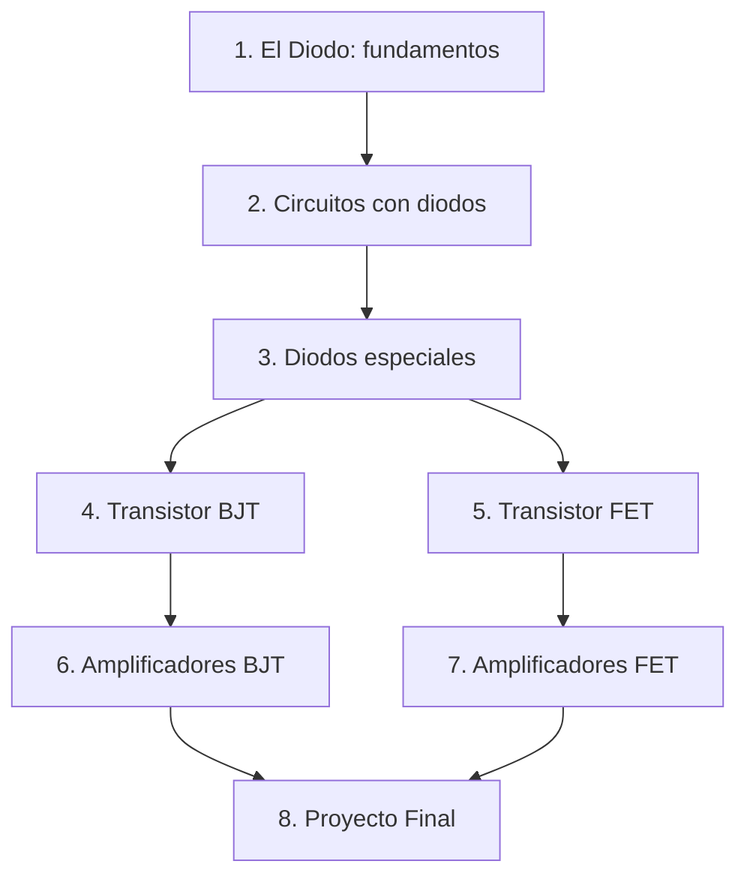

<!--
::METADATA::
type: reference
topic_id: guia-estudio
file_id: study-guide
status: active
audience: student
last_updated: 2026-02-07
-->

# 🎓 Guía de Estudio — Diodos y Transistores

> **Para estudiantes.** Ruta de aprendizaje recomendada y cómo usar este repositorio.

---

## ¿Cómo usar este repositorio?

### Paso 1: Orientación
- Lee el [README](../README.md) para tener el panorama general.
- Consulta el [Temario](../Temario.md) para conocer los temas oficiales de la materia.

### Paso 2: Navegación
- Usa el [Índice Wiki](../WIKI_INDEX.md) para encontrar cualquier recurso.
- Cada módulo tiene un archivo `00-Index.md` con la descripción y lista de subtemas.

### Paso 3: Estudio por Subtema
Dentro de cada subtema, sigue este orden:

```
1. *-Intro.md          → Visión general y objetivos
2. theory/             → Definiciones, teoremas, ecuaciones
3. methods/            → Procedimientos paso a paso
4. problems/           → Ejercicios para practicar
5. solutions/          → Verificar tus respuestas
```

### Paso 4: Apoyo
- Consulta el [Glosario](../glossary.md) para términos que no entiendas.
- Revisa las gráficas en `media/generated/` para visualizaciones.
- Guarda tus notas personales en la carpeta `Notas/` de cada subtema.

---

## Ruta de Aprendizaje Recomendada



### Prerrequisitos por Módulo

| Módulo | Prerrequisitos |
|--------|---------------|
| 01 - Circuitos con Diodos | Análisis de circuitos DC, Ley de Ohm, Kirchhoff |
| 02 - Transistor BJT | Módulo 01 completo |
| 03 - Transistor FET | Módulo 01 completo |
| 04 - Amplificadores | Módulos 02 y 03 completos, análisis AC básico |
| 05 - Proyecto Final | Todos los módulos anteriores |

---

## Convenciones de Notación

Consulta la [tabla de notación](../00-META/nomenclatura-estandar.md) para los símbolos estándar usados en todo el repositorio.

## Bibliografía

Consulta la [bibliografía general](../00-META/bibliografia-general.md) para los libros de texto recomendados.
