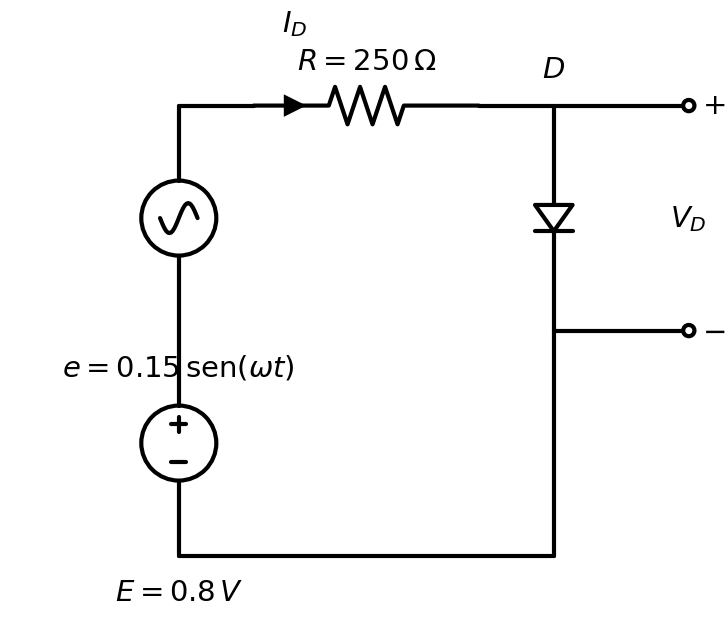

# Recta de carga (análisis en CD)

La **recta de carga** se construye con base en el análisis de corriente directa (CD).  
Retomando el circuito de CD visto previamente, se tiene una batería conectada a una resistencia en su terminal positiva; la resistencia se conecta en serie con un diodo y este cierra el circuito hacia la terminal negativa de la batería.

La corriente convencional $I_D$ circula desde la terminal positiva de la batería, atraviesa la resistencia, pasa por el diodo y regresa a la terminal negativa; en el esquema se representa en **sentido horario**.

Además, se incluye una leyenda con líneas que delimitan la rama del diodo para definir $V_D$, que representa el voltaje en el diodo.

## Esquema del circuito base

## Ecuación de la recta de carga

Aplicando LKV en la malla:

$$
R I_D + V_D = E
$$

Despejando corriente:

$$
I_D = \frac{E - V_D}{R}
$$

Por lo tanto, para construir la recta, la ecuación se evalúa en los puntos extremos tal y como sigue (gráfica de la corriente en el eje **Y** y el voltaje en el eje **X**):

- Si $V_D = 0$ entonces $I_D = \dfrac{E}{R}$.
- Si $I_D = 0$ entonces $V_D = E$.

La intersección entre esta recta y la curva característica $I$–$V$ del diodo determina el **punto de operación** o **punto Q**.

## Punto de operación para pequeña señal (caso con excitación AC+CD)

Retomando los valores del ejemplo anterior, se dibuja la recta de carga de CD y la curva característica del diodo para encontrar el punto de operación que se usa en el análisis de pequeña señal.

Dado el circuito: batería de $6\,V$ conectada en su terminal positivo a una fuente de voltaje alterno, esta fuente conectada a una resistencia de $270\,\Omega$, seguida por un diodo, y con la leyenda de $V_D$ para indicar el voltaje en el diodo; la fuente alterna se expresa como:

$$
v_s(t)=2\,\mathrm{sen}(\omega t)
$$

Para el punto de operación en CD se usa la fuente continua $E=6\,V$ y la resistencia $R=270\,\Omega$:

Primero se plantea la recta de carga:

$$
R I_D + V_D = E
$$

Ahora se realizan los cálculos en los extremos:

1. Para $V_D=0$:

$$
R I_D + 0 = E \Rightarrow I_D = \frac{E}{R} = \frac{6}{270}=0.02222\,A=22.22\,mA
$$

2. Para $I_D=0$:

$$
R(0)+V_D=E \Rightarrow V_D=E=6\,V
$$

Con estos resultados, los puntos de la recta son:

- $(V_D, I_D) = (0\,V,\;22.22\,mA)$
- $(V_D, I_D) = (6\,V,\;0\,mA)$

Después se crea la gráfica colocando:

- Eje **Y**: corriente $I_D$ en **mA**.
- Eje **X**: voltaje $V_D$ en **V**.

La intersección entre esta recta y la curva $I$–$V$ del diodo entrega el punto $Q$ de polarización.

### Resistencia dinámica del diodo en $Q$ (Ejemplo 1)

La resistencia dinámica (o de AC) del diodo en el punto de operación $Q$ se calcula a partir de la pendiente de la curva I–V en ese punto. Para el modelo de Shockley:

$$
r_d = \frac{n\,V_T}{I_{D_Q}}
$$

Con los valores del punto $Q$ calculado ($V_Q \approx 0.617\,V$, $I_Q \approx 19.94\,mA$):

$$
r_d = \frac{1 \times 0.026}{0.01994} = 1.304\,\Omega
$$

> **Interpretación con $\Delta V_D = 1\,V$:** Si se aplicara una variación de $1\,V$ directamente sobre el diodo en $Q$, la variación de corriente sería:
>
> $$\Delta I_D = \frac{\Delta V_D}{r_d} = \frac{1}{1.304} = 766.9\,mA$$
>
> Este valor enorme evidencia que la curva exponencial del diodo es extremadamente sensible a cambios de voltaje; un $\Delta V_D = 1\,V$ excede por mucho el rango lineal alrededor de $Q$ y no es práctico para la aproximación de pequeña señal.

### Diferencia entre valores en CD y valores máximos instantáneos

Los cálculos anteriores corresponden a la **recta de carga en CD** (polarización base para el punto $Q$), usando solo $E=6\,V$.

Si además se consideran los extremos instantáneos de la fuente alterna $v_s(t)=2\,\mathrm{sen}(\omega t)$, el voltaje efectivo en la malla varía entre:

$$
E_{\max}=6+2=8\,V, \qquad E_{\min}=6-2=4\,V
$$

Tomando aproximación ideal en el intercepto de corriente ($V_D\approx 0$):

$$
I_{D,\max}\approx \frac{8}{270}=29.63\,mA, \qquad
I_{D,\min}\approx \frac{4}{270}=14.81\,mA
$$

Por ello, en la gráfica se muestran:

- Recta de carga **CD** (la que fija el punto $Q$).
- Recta límite para **$E_{\max}$**.
- Recta límite para **$E_{\min}$**.

### Ejemplo adicional: ajuste de la recta y nueva $Q$ objetivo

Si inicialmente se propone el punto:

$$
Q=(I_D, V_D)=(19\,mA,\;1.5\,V)
$$

y se mantiene la resistencia del ejemplo actual $R=270\,\Omega$, entonces la fuente equivalente debe cumplir:

$$
E = R I_D + V_D
$$

Sustituyendo:

$$
E = 270(0.019)+1.5 = 6.63\,V
$$

Por lo tanto, el ajuste en los datos actuales es:

$$
\Delta E = 6.63 - 6.00 = +0.63\,V
$$

Con ese ajuste, la recta de carga queda en:

$$
I_D = \frac{6.63 - V_D}{270}
$$

y la **nueva $Q$ objetivo real** se toma como la intersección de esa recta con la curva $I$–$V$ del diodo (modelo usado en la gráfica), resultando aproximadamente:

$$
Q^* \approx (V_D\approx 0.62\,V,\; I_D\approx 22.3\,mA)
$$

En el caso con excitación AC+CD:

$$
E(t)=6+2\,\mathrm{sen}(\omega t)
$$

esa condición se cumple cuando:

$$
6+2\,\mathrm{sen}(\omega t)=6.63
\Rightarrow \mathrm{sen}(\omega t)=0.315
$$

Esto significa que el punto $(19\,mA,\;1.5\,V)$ sirve como referencia de ajuste de recta, pero la intersección física con la curva del diodo (y por tanto el punto de operación consistente del modelo) es la $Q^*$ calculada arriba.

### Resistencia dinámica del diodo en $Q^*$ (Ejemplo 2)

Análogamente, para el punto $Q^*$ con $E^* = 6.63\,V$ ($V_{Q^*} \approx 0.619\,V$, $I_{Q^*} \approx 22.26\,mA$):

$$
r_d^* = \frac{n\,V_T}{I_{D_{Q^*}}} = \frac{0.026}{0.02226} = 1.168\,\Omega
$$

> **Interpretación con $\Delta V_D = 1\,V$:**
>
> $$\Delta I_D = \frac{1}{1.168} = 856.2\,mA$$
>
> Al aumentar la corriente de polarización, $r_d$ disminuye: el diodo se vuelve aún más "rígido" en voltaje y más sensible a variaciones. En ambos ejemplos, $r_d \ll R$ ($1.3\,\Omega \ll 270\,\Omega$), confirmando que prácticamente toda la señal AC cae sobre la resistencia del circuito.

---

## Ejercicio: Análisis completo con curva I-V (modelo Shockley)

### Enunciado

Se tiene el siguiente circuito: una batería de $0.8\,V$ conectada en su terminal positiva a una fuente de voltaje alterno $e = 0.15\,\mathrm{sen}(\omega t)$; la fuente va conectada a una resistencia de $250\,\Omega$ y esa resistencia va conectada a un diodo que cierra el circuito hacia la terminal negativa de la batería.

La curva I-V del diodo pasa por los siguientes puntos:

| $V_D$ (V) | $I_D$ (mA) |
|:---:|:---:|
| 0.4 | 0 |
| 0.6 | 1 |
| 0.64 | 3 |

### Ajuste del modelo del diodo

Para obtener resultados precisos, los tres puntos dados se ajustan al **modelo de Shockley** (exponencial) en lugar de usar tramos lineales:

$$
I_D = I_S \left( e^{V_D / nV_T} - 1 \right)
$$

**Cálculo de $n$** (usando los puntos $(0.6\,V,\;1\,mA)$ y $(0.64\,V,\;3\,mA)$):

$$
\frac{I_2}{I_1} = e^{(V_2 - V_1)/nV_T} \;\Rightarrow\; \ln\!\left(\frac{3}{1}\right) = \frac{0.04}{n \cdot 0.026}
$$

$$
n = \frac{0.04}{0.026 \cdot \ln(3)} = \frac{0.04}{0.02858} \approx 1.40
$$

**Cálculo de $I_S$:**

$$
I_S = \frac{I_1}{e^{V_1/nV_T} - 1} = \frac{0.001}{e^{0.6/0.0364} - 1} \approx 7.24 \times 10^{-11}\,A
$$

**Verificación** en $V_D = 0.4\,V$:

$$
I_D = 7.24 \times 10^{-11} \left(e^{0.4/0.0364} - 1\right) \approx 4.3\,\mu A \approx 0\,mA \;\checkmark
$$

### a) Recta de carga de CD y punto de operación

Ecuación de la malla en CD:

$$
R\,I_D + V_D = E \;\Rightarrow\; I_D = \frac{0.8 - V_D}{250}
$$

Evaluando en los extremos:

1. $V_D = 0$: $\;I_D = \dfrac{0.8}{250} = 3.20\,mA$

2. $I_D = 0$: $\;V_D = 0.8\,V$

El punto $Q$ se obtiene resolviendo **numéricamente** la intersección de la recta con la exponencial:

$$
\frac{0.8 - V_D}{250} = 7.24 \times 10^{-11}\left(e^{V_D/0.0364} - 1\right)
$$

$$
\boxed{Q_{CD} = \left(V_{D_Q} = 0.594\,V,\;\; I_{D_Q} = 0.824\,mA\right)}
$$

### b) Valores máximos y mínimos con señal AC

Con $e(t) = 0.15\,\mathrm{sen}(\omega t)$, el voltaje total de la malla varía entre:

$$
E_{\max} = 0.8 + 0.15 = 0.95\,V, \qquad E_{\min} = 0.8 - 0.15 = 0.65\,V
$$

Los puntos de operación instantáneos se obtienen resolviendo numéricamente la intersección de cada recta desplazada con la curva exponencial:

| Condición | $V_D$ (mV) | $I_D$ (mA) |
|:---:|:---:|:---:|
| $E_{\min} = 0.65\,V$ | 565 | 0.340 |
| $E_{CD} = 0.80\,V$ (Q) | 594 | 0.824 |
| $E_{\max} = 0.95\,V$ | 615 | 1.340 |

$$
\boxed{\Delta V_D = 615 - 565 = 50\,mV, \quad \Delta I_D = 1.340 - 0.340 = 1.000\,mA}
$$

### c) Resistencia de CD del diodo

La resistencia estática (de CD) se calcula como la relación voltaje/corriente en el punto $Q$:

$$
R_{CD} = \frac{V_{D_Q}}{I_{D_Q}} = \frac{0.594}{0.000824} = 720.9\,\Omega
$$

$$
\boxed{R_{CD} = 720.9\,\Omega}
$$

> **Nota:** Esta resistencia no es la pendiente de la curva, sino la pendiente de la recta que une el origen con el punto $Q$ en la característica I-V.

### d) Resistencia dinámica del diodo

La resistencia dinámica se obtiene de la derivada de la curva $I$-$V$ evaluada en el punto $Q$:

$$
r_d = \frac{n\,V_T}{I_{D_Q}} = \frac{1.40 \times 0.026}{0.000824} = \frac{0.0364}{0.000824} = 44.17\,\Omega
$$

$$
\boxed{r_d = 44.17\,\Omega}
$$

**Verificación gráfica** (pendiente promedio del arco entre $Q_{\min}$ y $Q_{\max}$):

$$
r_d \approx \frac{\Delta V_D}{\Delta I_D} = \frac{50\,mV}{1.000\,mA} = 50\,\Omega
$$

> **Nota:** La diferencia entre $44.17\,\Omega$ (analítico) y $50\,\Omega$ (gráfico) se debe a que el swing AC de $\pm 0.15\,V$ no es infinitesimal; $r_d$ es la pendiente instantánea en $Q$, mientras que el cociente gráfico promedia un arco finito de la exponencial.

### Comparación: modelo lineal vs. exponencial

| Parámetro | Lineal a tramos | Shockley (exponencial) | Diferencia |
|:---:|:---:|:---:|:---:|
| $V_{D_Q}$ | $578\,mV$ | $594\,mV$ | $+16\,mV$ |
| $I_{D_Q}$ | $0.889\,mA$ | $0.824\,mA$ | $-0.065\,mA$ |
| $R_{CD}$ | $650\,\Omega$ | $720.9\,\Omega$ | $+70.9\,\Omega$ |
| $r_d$ | $200\,\Omega$ | $44.17\,\Omega$ | $-155.8\,\Omega$ |

> La resistencia dinámica es donde mayor impacto tiene el modelo: **200 Ω vs 44 Ω**. El modelo lineal sobrestima $r_d$ por un factor de ~4.5× porque usa una pendiente constante en lugar de la derivada exponencial real en $Q$.

### Comparación: $R_{CD}$ vs $r_d$

| Parámetro | Valor | Significado |
|:---:|:---:|:---|
| $R_{CD}$ | $720.9\,\Omega$ | Resistencia estática vista desde el origen hasta $Q$ |
| $r_d$ | $44.17\,\Omega$ | Resistencia dinámica (pendiente instantánea de la curva en $Q$) |

La diferencia $R_{CD} \gg r_d$ es típica: la zona de conducción del diodo tiene alta pendiente (baja $r_d$), pero la recta desde el origen incluye la zona de no-conducción ($V_D < V_K$), elevando $R_{CD}$.

