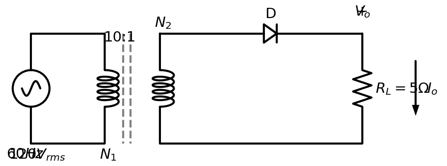

## Rectificadores de Señal

Una de las aplicaciones más importantes de los diodos, especialmente en el contexto de "gran señal", es su uso en **convertidores de potencia**. Dentro de esta categoría, los **rectificadores** son circuitos fundamentales.

### ¿Qué es un Rectificador?

Un rectificador es un circuito electrónico que convierte una señal de **corriente alterna (CA)** en una señal de **corriente directa (CD)** pulsante. Su función principal es permitir el flujo de corriente en una sola dirección, bloqueando el flujo en la dirección opuesta.

Esta conversión CA-CD es esencial para la operación de prácticamente todos los dispositivos electrónicos, desde cargadores de teléfonos móviles y computadoras personales (nivel comercial) hasta fuentes de alimentación para maquinaria pesada (nivel industrial), ya que la energía eléctrica se distribuye comúnmente como CA, pero los circuitos internos de los dispositivos requieren CD para funcionar.

### Tipos de Rectificadores

Los rectificadores se clasifican principalmente según la fase de la señal de entrada y la porción de la onda de CA que aprovechan.

#### 1. Rectificador Monofásico de Media Onda

El rectificador de media onda es la topología más simple. Utiliza un único diodo para eliminar la mitad de la forma de onda de entrada de CA, permitiendo que solo pase el semiciclo positivo (o negativo, dependiendo de la orientación del diodo).

*   **Funcionamiento:** Durante el semiciclo positivo de la tensión de entrada, el diodo se polariza en directa y permite el paso de la corriente hacia la carga. Durante el semiciclo negativo, el diodo se polariza en inversa, se comporta como un circuito abierto e interrumpe el flujo de corriente.
*   **Ventajas:** Simplicidad y bajo costo (un solo diodo).
*   **Desventajas:** Baja eficiencia, ya que solo se aprovecha la mitad de la señal de entrada. La salida de CD es muy pulsante (alto rizado), lo que a menudo requiere un filtrado significativo para suavizar la tensión.

> **Figura 1.** Diagrama esquemático de un rectificador de media onda básico. El circuito consta de una fuente de voltaje alterno sinusoidal $v_s(t) = V_m \sin(\omega t)$, donde la frecuencia angular es $\omega = 2\pi f$, conectada en serie con un diodo rectificador y una resistencia de carga $R_L$.

El voltaje pico de la señal de entrada $V_m$ se relaciona con el valor RMS ($V_{rms}$ o $V$) mediante:

$$ V_m = \sqrt{2} V_{rms} $$

El comportamiento del rectificador se analiza dividiendo el periodo de la señal de entrada en dos intervalos principales, conforme se ilustra en la **Figura 2**:

1.  **Semiciclo Positivo ($0 < \omega t < \pi$):** El diodo se polariza en directa (suponiendo modelo ideal, actúa como cortocircuito). La tensión en la carga sigue a la entrada: $v_o(t) = v_s(t)$.
2.  **Semiciclo Negativo ($\pi < \omega t < 2\pi$):** El diodo se polariza en inversa (actúa como circuito abierto). La corriente es cero y la tensión en la carga es nula: $v_o(t) = 0$. Todo el voltaje inverso cae sobre el diodo: $v_D(t) = v_s(t)$.

> **Figura 2.** Formas de onda del rectificador de media onda. (Superior) Voltaje de entrada $v_s(t)$ con amplitud $V_m$. (Medio) Voltaje de salida rectificado $v_o(t)$ en la carga $R_L$, mostrando solo los semiciclos positivos. (Inferior) Voltaje en el diodo $v_D(t)$, soportando la tensión inversa durante los semiciclos negativos.

### Transferencia de Energía y Valores Promedio

El funcionamiento del circuito determina cuándo la fuente entrega potencia a la carga:

*   **En el intervalo $0 \le \omega t \le \pi$ (Polarización Directa):** El diodo conduce y la fuente de voltaje transfiere energía a la carga $R_L$.
*   **En el intervalo $\pi \le \omega t \le 2\pi$ (Polarización Inversa):** El diodo se comporta como un circuito abierto, desconectando la fuente de la carga, por lo que esta no recibe energía.

A continuación, se calculan los parámetros de corriente directa (CD) o valores promedio de la señal rectificada.

#### 1. Voltaje Promedio de Salida ($V_{CD}$)

El valor promedio (o de CD) se define como el área bajo la curva en un periodo completo $T=2\pi$, dividida por la duración del periodo:

$$ V_{CD} = \frac{1}{2\pi} \int_{0}^{2\pi} v_o(\omega t) \, d(\omega t) $$

Dado que $v_o = V_m \sin(\omega t)$ para $0 \le \omega t \le \pi$ y $v_o = 0$ para $\pi \le \omega t \le 2\pi$, la integral se reduce al primer intervalo:

$$ \begin{aligned} V_{CD} &= \frac{1}{2\pi} \int_{0}^{\pi} V_m \sin(\omega t) \, d(\omega t) \\ &= \frac{V_m}{2\pi} \left[ -\cos(\omega t) \right]_{0}^{\pi} \\ &= \frac{V_m}{2\pi} \left[ -(\cos(\pi) - \cos(0)) \right] \\ &= \frac{V_m}{2\pi} \left[ -(-1 - 1) \right] \\ &= \frac{V_m}{2\pi} (2) \end{aligned} $$

Simplificando, obtenemos la fórmula fundamental del rectificador de media onda:

$$ V_{CD} = \frac{V_m}{\pi} \approx 0.318 V_m $$

#### 2. Corriente Promedio de Salida ($I_{CD}$)

La corriente promedio se puede calcular mediante la Ley de Ohm ($I_{CD} = V_{CD}/R_L$) o integrando la forma de onda de la corriente a lo largo de un ciclo completo:

$$ I_{CD} = \frac{1}{2\pi} \int_{0}^{2\pi} i_D(\omega t) \, d(\omega t) $$

Dado que $i_D(\omega t) = \frac{V_m}{R_L} \sin(\omega t)$ en el intervalo $0 \le \omega t \le \pi$ (el diodo conduce) y $i_D(\omega t) = 0$ en el resto del ciclo:

$$ \begin{aligned} I_{CD} &= \frac{1}{2\pi} \int_{0}^{\pi} \frac{V_m}{R_L} \sin(\omega t) \, d(\omega t) \\ &= \frac{V_m}{2\pi R_L} \left[ -\cos(\omega t) \right]_{0}^{\pi} \\ &= \frac{V_m}{2\pi R_L} \left[ -(-1 - 1) \right] \\ &= \frac{2 V_m}{2\pi R_L} \end{aligned} $$

Simplificando, obtenemos:

$$ I_{CD} = \frac{V_m}{\pi R_L} \approx 0.318 \frac{V_m}{R_L} $$

#### 3. Voltaje Eficaz de Salida ($V_{rms}$)

El valor eficaz (RMS, *Root Mean Square*) es crucial para el cálculo de potencia. Se define como la raíz cuadrada del promedio del cuadrado de la función:

$$ V_{rms} = \sqrt{ \frac{1}{2\pi} \int_{0}^{2\pi} v_o^2(\omega t) \, d(\omega t) } $$

Sustituyendo $v_o(\omega t) = V_m \sin(\omega t)$ para el primer semiciclo y $0$ para el segundo:

$$ \begin{aligned} V_{rms} &= \sqrt{ \frac{1}{2\pi} \int_{0}^{\pi} (V_m \sin(\omega t))^2 \, d(\omega t) } \\ &= \sqrt{ \frac{V_m^2}{2\pi} \int_{0}^{\pi} \sin^2(\omega t) \, d(\omega t) } \end{aligned} $$

Utilizando la identidad trigonométrica $\sin^2(\theta) = \frac{1 - \cos(2\theta)}{2}$:

$$ \begin{aligned} V_{rms} &= \sqrt{ \frac{V_m^2}{2\pi} \int_{0}^{\pi} \frac{1 - \cos(2\omega t)}{2} \, d(\omega t) } \\ &= \sqrt{ \frac{V_m^2}{4\pi} \left[ \omega t - \frac{\sin(2\omega t)}{2} \right]_{0}^{\pi} } \\ &= \sqrt{ \frac{V_m^2}{4\pi} \left[ (\pi - 0) - (0 - 0) \right] } \\ &= \sqrt{ \frac{V_m^2 \cdot \pi}{4\pi} } = \sqrt{ \frac{V_m^2}{4} } \end{aligned} $$

Por lo tanto, el voltaje RMS en la carga para un rectificador de media onda es:

$$ V_{rms} = \frac{V_m}{2} $$

#### 4. Corriente Eficaz de Salida ($I_{rms}$)

De manera análoga, la corriente eficaz (RMS) se calcula integrando el cuadrado de la corriente a lo largo de un ciclo. Dado que la corriente en la carga es lineal con el voltaje ($i_o = v_o / R_L$), esperamos una relación similar.

Definición del valor RMS para la corriente:

$$ I_{rms} = \sqrt{ \frac{1}{2\pi} \int_{0}^{2\pi} i_D^2(\omega t) \, d(\omega t) } $$

Sustituyendo $i_D(\omega t) = \frac{V_m}{R_L} \sin(\omega t)$ (o $I_m \sin(\omega t)$) para el primer semiciclo ($0 \le \omega t \le \pi$) y $0$ para el segundo:

$$ \begin{aligned} I_{rms} &= \sqrt{ \frac{1}{2\pi} \int_{0}^{\pi} \left(\frac{V_m}{R_L} \sin(\omega t)\right)^2 \, d(\omega t) } \\ &= \sqrt{ \frac{1}{2\pi} \left(\frac{V_m}{R_L}\right)^2 \int_{0}^{\pi} \sin^2(\omega t) \, d(\omega t) } \end{aligned} $$

Resolviendo la integral $\int_{0}^{\pi} \sin^2(\omega t) d(\omega t)$ que, como vimos en el apartado anterior, es igual a $\frac{\pi}{2}$:

$$ \begin{aligned} I_{rms} &= \sqrt{ \frac{I_m^2}{2\pi} \left( \frac{\pi}{2} \right) } \\ &= \sqrt{ \frac{I_m^2}{4} } \end{aligned} $$

Finalmente, la corriente RMS es la mitad de la corriente pico:

$$ I_{rms} = \frac{I_m}{2} = \frac{V_m}{2 R_L} $$

### Rizo y Potencia de Salida

#### Voltaje de Rizo RMS ($V_{r(rms)}$)

El voltaje en la carga $R_L$ de un rectificador no es puramente continuo; tiene una componente de directa ($V_{CD}$) y una componente variable o de "rizo". El voltaje eficaz total ($V_{rms}$) se puede expresar como la suma cuadrática de estas dos componentes:

$$ V_{rms}^2 = V_{CD}^2 + V_{r(rms)}^2 $$

Despejando el voltaje de rizo RMS:

$$ V_{r(rms)} = \sqrt{V_{rms}^2 - V_{CD}^2} $$

Sustituyendo los valores calculados previamente para el rectificador de media onda:
*   $V_{rms} = \frac{V_m}{2}$
*   $V_{CD} = \frac{V_m}{\pi}$

$$ \begin{aligned} V_{r(rms)} &= \sqrt{ \left(\frac{V_m}{2}\right)^2 - \left(\frac{V_m}{\pi}\right)^2 } \\ &= V_m \sqrt{ \frac{1}{4} - \frac{1}{\pi^2} } \\ &= V_m \sqrt{ 0.25 - 0.1013 } \\ &= V_m \sqrt{ 0.1487 } \\ &\approx 0.385 V_m \end{aligned} $$

Ahora, para expresar $V_{r(rms)}$ en función de $V_{CD}$, usamos la relación $V_m = \pi V_{CD}$:

$$ \begin{aligned} V_{r(rms)} &= 0.385 (\pi V_{CD}) \\ &= 1.21 V_{CD} \end{aligned} $$

#### Factor de Rizo ($FR$)

El Factor de Rizo ($FR$ o $r$) es una medida adimensional de qué tanto componente alterna tiene la señal rectificada en comparación con su componente directa. Se define como:

$$ FR = \frac{V_{r(rms)}}{V_{CD}} \times 100\% $$

Sustituyendo la relación anterior del voltaje de rizo:

$$ \begin{aligned} FR &= \frac{\sqrt{V_{rms}^2 - V_{CD}^2}}{V_{CD}} \\ &= \sqrt{\left(\frac{V_{rms}}{V_{CD}}\right)^2 - 1} \\ &= \sqrt{\left(\frac{V_m/2}{V_m/\pi}\right)^2 - 1} \quad \left(\text{donde } \frac{V_{rms}}{V_{CD}} = \frac{\pi}{2} = 1.57\right)\\ &= \sqrt{(1.57)^2 - 1} \\ &= \sqrt{2.467 - 1} = \sqrt{1.467} \\ &\approx 1.21 \end{aligned} $$

Esto significa que el rectificador de media onda tiene un rizo del **121%**, lo cual indica que la componente alterna es mayor que la componente directa, confirmando su baja calidad como fuente de DC sin filtrado.

#### Potencia Total de Salida ($P_{RMS}$)

La potencia total disipada por la carga $R_L$ (incluyendo tanto la componente continua como la alterna) se calcula utilizando los valores eficaces (RMS) de voltaje y corriente:

$$ P_{RMS} = I_{rms}^2 R_L = \frac{V_{rms}^2}{R_L} $$

Sustituyendo $V_{rms} = \frac{V_m}{2}$ e $I_{rms} = \frac{I_m}{2}$:

$$ P_{RMS} = \frac{(V_m/2)^2}{R_L} = \frac{V_m^2}{4 R_L} $$

Esta potencia total se compone de dos partes: la potencia entregada por la componente de corriente directa (CD) y la potencia disipada por la componente de corriente alterna (CA).

#### 1. Potencia de Salida en CD ($P_{CD}$)

Esta es la "potencia útil" en aplicaciones de corriente continua. Se calcula utilizando únicamente los valores promedio:

$$ P_{CD} = I_{CD}^2 R_L = V_{CD} I_{CD} = \frac{V_{CD}^2}{R_L} $$

Sustituyendo $V_{CD} = \frac{V_m}{\pi}$:

$$ P_{CD} = \frac{(V_m/\pi)^2}{R_L} = \frac{V_m^2}{\pi^2 R_L} \approx \frac{0.1013 V_m^2}{R_L} $$

#### 2. Potencia de Salida en CA ($P_{CA}$)

Esta potencia representa la energía asociada al rizo (la fluctuación) y generalmente se considera pérdida o ruido en fuentes de alimentación de CD. Se calcula usando el voltaje de rizo eficaz ($V_{r(rms)}$):

$$ P_{CA} = \frac{V_{r(rms)}^2}{R_L} $$

Recordando que $V_{r(rms)} = \sqrt{V_{rms}^2 - V_{CD}^2}$, podemos expresar la potencia de CA como la diferencia entre la potencia total y la de CD:

$$ P_{CA} = P_{RMS} - P_{CD} $$

Desarrollando:

$$ \begin{aligned} P_{CA} &= \frac{V_m^2}{4 R_L} - \frac{V_m^2}{\pi^2 R_L} \\ &= \frac{V_m^2}{R_L} \left( \frac{1}{4} - \frac{1}{\pi^2} \right) \\ &= \frac{V_m^2}{R_L} (0.25 - 0.1013) \\ &= \frac{0.1487 V_m^2}{R_L} \end{aligned} $$

### Ejemplo de Aplicación

**Problema:** El rectificador de media onda de la siguiente figura se alimenta con una fuente de $120\,V_{rms}$ a $60\,Hz$ en el primario del transformador reductor, el cual tiene una relación de vueltas de $10:1$. La resistencia de carga es $R_L = 5\,\Omega$. Determine:
a) El voltaje pico en la carga ($V_m$).
b) El voltaje de corriente directa ($V_{CD}$).
c) La corriente promedio en la carga ($I_{CD}$).
d) La potencia entregada en CD ($P_{CD}$) y la potencia total ($P_{RMS}$).

> **Figura 3.** Rectificador de media onda con transformador reductor.

**Solución:**

**Paso 1: Determinar el voltaje en el secundario.**
Primero calculamos el voltaje RMS en el secundario ($V_{rms(sec)}$) usando la relación de transformación $a = N_1/N_2 = 10$:

$$ V_{rms(sec)} = \frac{V_{rms(pri)}}{a} = \frac{120\,V}{10} = 12\,V_{rms} $$

**Paso 2: Calcular el voltaje pico ($V_m$).**
Convertimos el valor RMS del secundario a voltaje pico (amplitud máxima):

$$ V_m = \sqrt{2} \cdot V_{rms(sec)} = 1.4142 \cdot 12\,V \approx 16.97\,V $$

**Paso 3: Calcular el voltaje de CD ($V_{CD}$).**
Usamos la fórmula del rectificador de media onda:

$$ V_{CD} = \frac{V_m}{\pi} = \frac{16.97\,V}{\pi} \approx 5.40\,V $$

**Paso 4: Calcular la corriente promedio ($I_{CD}$).**
Aplicando la Ley de Ohm en la carga:

$$ I_{CD} = \frac{V_{CD}}{R_L} = \frac{5.40\,V}{5\,\Omega} = 1.08\,A $$

**Paso 5: Calcular potencias.**

Potencia en CD:
$$ P_{CD} = I_{CD}^2 R_L = (1.08\,A)^2 (5\,\Omega) = 1.166 \cdot 5 = 5.83\,W $$

Potencia Total (RMS):
Primero obtenemos $I_{rms}$:
$$ I_{rms} = \frac{I_m}{2} = \frac{V_m}{2 R_L} = \frac{16.97}{10} \approx 1.697\,A $$
$$ P_{RMS} = I_{rms}^2 R_L = (1.697)^2 \cdot 5 \approx 2.88 \cdot 5 = 14.4\,W $$

*(Nota: La eficiencia de conversión es $\eta = P_{CD}/P_{RMS} = 5.83/14.4 \approx 40.5\%$, muy cercana al máximo teórico del 40.6%)*
