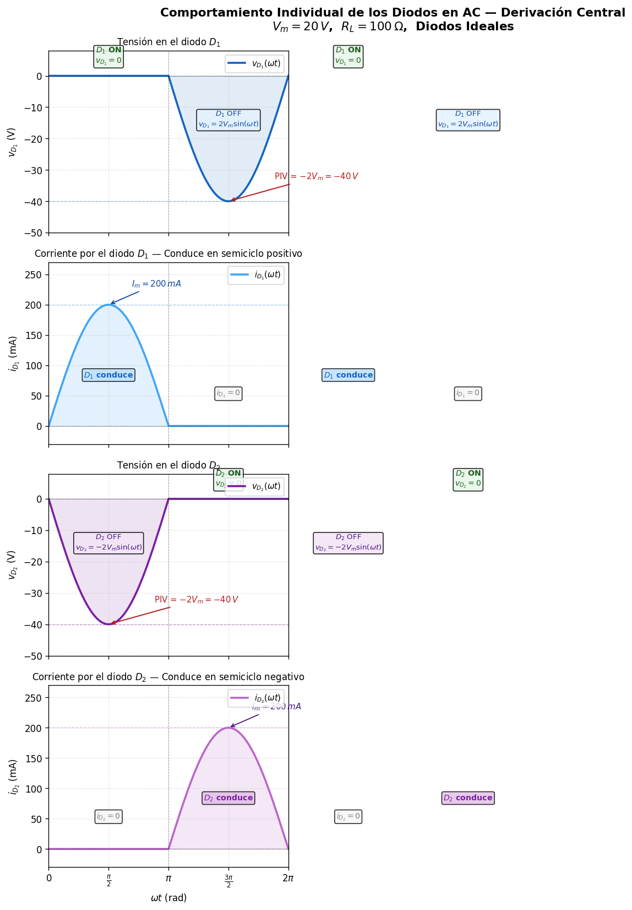

<!--
::METADATA::
type: theory
topic_id: rectificador-onda-completa-derivacion-central
file_id: Nota5
status: draft
audience: student
last_updated: 2026-02-25
-->

> 🏠 **Navegación:** [← Volver al Índice](../../WIKI_INDEX.md) | [📚 Glosario](../../glossary.md) | [🔙 Notas DIO](README.md)

---

# Rectificador Monofásico de Onda Completa con Derivación Central

## Introducción

El rectificador monofásico con derivación central (también llamado *rectificador de punto medio* o *center-tap*) es un circuito de **onda completa** que, a diferencia del rectificador de media onda, **aprovecha la energía contenida en ambos semiciclos** de la señal de entrada — tanto el positivo como el negativo. Esto se traduce en un voltaje de salida DC más elevado y un menor contenido de rizado, lo que lo convierte en una topología más eficiente para fuentes de alimentación.

El circuito emplea un **transformador con toma central** (center-tap) y **dos diodos** que conducen de forma alternada: mientras uno rectifica el semiciclo positivo, el otro rectifica el semiciclo negativo. El resultado es una señal pulsante unipolar con el **doble de frecuencia** respecto a la señal de entrada.

---

## Datos del circuito

| Parámetro | Valor |
|-----------|-------|
| Voltaje secundario | $V_s = V_m \sin(\omega t)$ |
| Transformador | Con derivación central (center-tap) |
| Diodos | $D_1$ y $D_2$ — silicio ($V_D = 0.7\,\text{V}$) / ideal ($V_D = 0$) |
| Resistencia de carga | $R_L$ |

---

## 1. Principio de funcionamiento

El transformador con derivación central divide el devanado secundario en **dos mitades iguales**, cada una proporcionando un voltaje $V_m$ respecto al punto central (tierra). Los dos diodos se conectan a los extremos del secundario, y sus cátodos se unen en un nodo común que alimenta la carga $R_L$.

### Semiciclo positivo ($0 < \omega t < \pi$)

Durante el semiciclo positivo de la señal de entrada:

- El extremo superior del secundario es **positivo** respecto al punto central.
- **$D_1$ conduce** (polarizado en directa) y la corriente fluye a través de $R_L$.
- **$D_2$ está en corte** (polarizado en inversa), ya que el extremo inferior es negativo.
- El voltaje en la carga es:

$$v_o(t) = V_m \sin(\omega t) - V_D$$

### Semiciclo negativo ($\pi < \omega t < 2\pi$)

Durante el semiciclo negativo:

- El extremo inferior del secundario se vuelve **positivo** respecto al punto central.
- **$D_2$ conduce** (polarizado en directa) y la corriente fluye a través de $R_L$ **en la misma dirección** que antes.
- **$D_1$ está en corte** (polarizado en inversa).
- El voltaje en la carga es nuevamente:

$$v_o(t) = V_m |\sin(\omega t)| - V_D$$

> **Resultado clave:** La carga recibe pulsos de corriente durante **ambos** semiciclos, produciendo una señal rectificada de onda completa.

---

## 2. Circuito esquemático

El circuito del rectificador monofásico con derivación central y sus formas de onda se muestran en la siguiente figura:

---

## 3. Formas de onda

Las formas de onda del voltaje de entrada $v_s$, voltaje de salida $v_o$ y la tensión inversa en los diodos se presentan a continuación:

**Observaciones clave de las formas de onda:**

1. **Frecuencia de salida duplicada:** La señal rectificada tiene una frecuencia de $2f$, es decir, aparecen **dos pulsos** por cada ciclo de la señal de entrada. Esto reduce significativamente el rizado en comparación con el rectificador de media onda.

2. **Continuidad de la corriente:** No existen intervalos en los que la corriente por $R_L$ sea cero (excepto los cruces por cero instantáneos), lo que mejora la eficiencia de transferencia de potencia.

3. **Tensión inversa de pico (PIV):** Cuando $D_1$ conduce, el punto superior del secundario está a $+V_m$ y el punto inferior a $-V_m$. El diodo $D_2$ soporta la diferencia completa:

$$\text{PIV} = 2V_m - V_D \approx 2V_m$$

> ⚠️ El PIV en el rectificador de derivación central es el **doble** que en el rectificador de media onda. Esto es una desventaja que debe considerarse en la selección de los diodos.

---

## 3.1 Comportamiento individual de los diodos en AC

La siguiente figura muestra en detalle el voltaje y la corriente de cada diodo durante un ciclo completo de la señal de entrada. Esto permite visualizar la **conducción alternada** de $D_1$ y $D_2$:

**Análisis por diodo:**

- **$D_1$ (semiciclo positivo, $0 < \omega t < \pi$):**
  - **Conduce:** $v_{D_1} = 0\,V$ (ideal), corriente $i_{D_1} = V_m \sin(\omega t) / R_L$.
  - **Bloqueado** (semiciclo negativo): $v_{D_1} = 2V_m \sin(\omega t)$ → alcanza $-2V_m$ (PIV).

- **$D_2$ (semiciclo negativo, $\pi < \omega t < 2\pi$):**
  - **Conduce:** $v_{D_2} = 0\,V$ (ideal), corriente $i_{D_2} = V_m |\sin(\omega t)| / R_L$.
  - **Bloqueado** (semiciclo positivo): $v_{D_2} = -2V_m \sin(\omega t)$ → alcanza $-2V_m$ (PIV).

> **Observación clave:** Los diodos se turnan para conducir. La corriente por $R_L$ es la suma $i_{R_L} = i_{D_1} + i_{D_2}$, resultando en un flujo continuo en la misma dirección.

---

## 4. Ecuaciones fundamentales — Derivación matemática

En el rectificador de onda completa, la señal de salida es $v_o(\omega t) = V_m |\sin(\omega t)|$, la cual tiene un período efectivo de $T/2$ (es decir, $\pi$ radianes). Por simetría, basta integrar un solo pulso $[0, \pi]$ y normalizar respecto al período completo $T = 2\pi$.

### 4.1 Voltaje promedio de CD ($V_{o(CD)}$)

El valor promedio (componente DC) se obtiene integrando la señal de salida sobre un período completo:

$$V_{o(CD)} = \frac{1}{T} \int_0^{T} v_o(\omega t)\, d(\omega t)$$

En el rectificador de onda completa hay **dos pulsos idénticos** por período $T = 2\pi$. Cada pulso abarca $[0, \pi]$, por lo que:

$$V_{o(CD)} = \frac{1}{2\pi} \int_0^{2\pi} V_m |\sin(\omega t)|\, d(\omega t) = \frac{1}{2\pi} \cdot 2 \int_0^{\pi} V_m \sin(\omega t)\, d(\omega t)$$

$$V_{o(CD)} = \frac{2V_m}{2\pi} \int_0^{\pi} \sin(\omega t)\, d(\omega t) = \frac{V_m}{\pi} \Big[-\cos(\omega t)\Big]_0^{\pi}$$

$$V_{o(CD)} = \frac{V_m}{\pi} \Big[-\cos(\pi) + \cos(0)\Big] = \frac{V_m}{\pi} \Big[-(-1) + 1\Big] = \frac{V_m}{\pi} \cdot 2$$

$$\boxed{V_{o(CD)} = \frac{2V_m}{\pi} \approx 0.636\, V_m}$$

> Este valor es exactamente el **doble** del voltaje promedio del rectificador de media onda ($V_m/\pi$).

---

### 4.2 Voltaje rms de salida ($V_{o(rms)}$)

El valor rms se obtiene tomando la raíz cuadrada del valor medio del cuadrado de la señal:

$$V_{o(rms)} = \sqrt{\frac{1}{T} \int_0^{T} v_o^2(\omega t)\, d(\omega t)}$$

Nuevamente, por simetría de los dos pulsos idénticos:

$$V_{o(rms)}^2 = \frac{1}{2\pi} \cdot 2 \int_0^{\pi} V_m^2 \sin^2(\omega t)\, d(\omega t) = \frac{V_m^2}{\pi} \int_0^{\pi} \sin^2(\omega t)\, d(\omega t)$$

Aplicando la identidad trigonométrica $\sin^2(\theta) = \frac{1 - \cos(2\theta)}{2}$:

$$V_{o(rms)}^2 = \frac{V_m^2}{\pi} \int_0^{\pi} \frac{1 - \cos(2\omega t)}{2}\, d(\omega t) = \frac{V_m^2}{2\pi} \left[\omega t - \frac{\sin(2\omega t)}{2}\right]_0^{\pi}$$

$$V_{o(rms)}^2 = \frac{V_m^2}{2\pi} \left[\pi - \frac{\sin(2\pi)}{2} - 0 + 0\right] = \frac{V_m^2}{2\pi} \cdot \pi = \frac{V_m^2}{2}$$

$$\boxed{V_{o(rms)} = \frac{V_m}{\sqrt{2}} \approx 0.707\, V_m}$$

> Este resultado es idéntico al rms de una senoide completa — lo cual tiene sentido porque la onda completa rectificada contiene la misma energía que la senoide original.

---

### 4.3 Corriente promedio de CD ($I_{o(CD)}$)

La corriente instantánea por la carga es $i_o(\omega t) = v_o(\omega t) / R_L$. Su valor promedio se calcula integrando de la misma forma que el voltaje:

$$I_{o(CD)} = \frac{1}{T} \int_0^{T} i_o(\omega t)\, d(\omega t) = \frac{1}{T} \int_0^{T} \frac{v_o(\omega t)}{R_L}\, d(\omega t) = \frac{1}{R_L} \cdot \frac{1}{T} \int_0^{T} v_o(\omega t)\, d(\omega t)$$

Reconociendo que la integral del voltaje ya fue evaluada en la sección 4.1:

$$I_{o(CD)} = \frac{V_{o(CD)}}{R_L} = \frac{1}{R_L} \cdot \frac{2V_m}{\pi}$$

$$\boxed{I_{o(CD)} = \frac{2V_m}{\pi R_L}}$$

---

### 4.4 Corriente rms ($I_{o(rms)}$)

El valor rms de la corriente sigue el mismo procedimiento que el voltaje rms, dividido por $R_L$:

$$I_{o(rms)} = \sqrt{\frac{1}{T} \int_0^{T} i_o^2(\omega t)\, d(\omega t)} = \sqrt{\frac{1}{T} \int_0^{T} \frac{v_o^2(\omega t)}{R_L^2}\, d(\omega t)} = \frac{1}{R_L} \sqrt{\frac{1}{T} \int_0^{T} v_o^2(\omega t)\, d(\omega t)}$$

La integral bajo la raíz es exactamente $V_{o(rms)}^2 = V_m^2 / 2$ (evaluada en la sección 4.2):

$$I_{o(rms)} = \frac{V_{o(rms)}}{R_L} = \frac{1}{R_L} \cdot \frac{V_m}{\sqrt{2}}$$

$$\boxed{I_{o(rms)} = \frac{V_m}{\sqrt{2}\, R_L}}$$

---

### 4.5 Voltaje de Rizo y Factor de Rizo

El "Voltaje de Rizo" es la componente de corriente alterna (AC) residual que permanece en la señal de salida. Aunque el rectificador convierte AC a DC, la salida no es una línea recta continua, sino pulsante.

#### Desarrollo matemático

El voltaje total eficaz ($V_{rms}$) de la señal de salida se compone de dos partes ortogonales:
1.  La componente de corriente directa ($V_{CD}$ o $V_{DC}$).
2.  La componente de corriente alterna o rizo ($V_{r(rms)}$).

La relación entre estos valores es:

$$ V_{rms}^2 = V_{DC}^2 + V_{r(rms)}^2 $$

Despejando el **Voltaje de Rizo RMS**:

$$ V_{r(rms)} = \sqrt{V_{rms}^2 - V_{DC}^2} $$

Sustituyendo las fórmulas obtenidas para la onda completa ($V_{rms} = V_m/\sqrt{2}$ y $V_{DC} = 2V_m/\pi$):

$$ V_{r(rms)} = \sqrt{ \left( \frac{V_m}{\sqrt{2}} \right)^2 - \left( \frac{2V_m}{\pi} \right)^2 } $$

$$ V_{r(rms)} = V_m \sqrt{ \frac{1}{2} - \frac{4}{\pi^2} } \approx V_m \sqrt{ 0.5 - 0.4053 } $$

$$ V_{r(rms)} = V_m \sqrt{ 0.0947 } $$

$$\boxed{V_{r(rms)} \approx 0.308\, V_m}$$

#### Factor de Rizo ($r$)

El factor de rizo compara la magnitud del rizo con el nivel de DC útil. Se define como:

$$ r = \frac{V_{r(rms)}}{V_{DC}} \times 100\% $$

Sustituyendo los valores:

$$ r = \frac{0.308\, V_m}{0.636\, V_m} \approx 0.483 $$

$$ \boxed{r \approx 48.3\%} $$

#### Comparación de Rizo y Similitudes con Media Onda

Es instructivo comparar el rizo en ambos rectificadores para entender por qué la onda completa es superior.

| Característica | Media Onda | Onda Completa | Similitud / Diferencia |
| :--- | :---: | :---: | :--- |
| **Frecuencia del rizo** | $f_{in}$ | $2f_{in}$ | El rizo de onda completa es el doble de rápido (más fácil de filtrar). |
| **Factor de rizo ($r$)**   *(Sin filtro)* | $1.21$ (121%) | $0.48$ (48%) | Ambos son intrínsecos a la forma de onda, pero onda completa tiene mucho menos "ruido" AC. |
| **Voltaje de rizo ($V_r$)**   *(Con filtro C)* | $\dfrac{I_{DC}}{f C}$ | $\dfrac{I_{DC}}{2 f C}$ | **Similitud:** La estructura de la fórmula es idéntica ($I/fC$).   **Diferencia:** El factor $2$ en el denominador reduce el rizo a la mitad en onda completa. |

> **Nota sobre el filtrado:** Aunque este circuito no tiene capacitor, la **fórmula del voltaje de rizo con filtro** ($V_r$) muestra una similitud estructural clave: ambas dependen inversamente de la capacitancia y la frecuencia. Sin embargo, debido a que la onda completa duplica la frecuencia ($2f$), el capacitor se descarga solo la mitad del tiempo entre picos, resultando en un voltaje de rizo que es **la mitad** que en media onda para el mismo valor de $C$.

---

### 4.6 Potencia de Salida y Eficiencia de Conversión

La "calidad" de un rectificador no solo se mide por suavidad de su voltaje (rizo), sino por la eficiencia con la que convierte la potencia de corriente alterna (AC) de entrada en potencia de corriente directa (DC) útil en la carga.

#### Potencia de Salida CD ($P_{DC}$)

Es la potencia útil entregada a la carga resistiva $R_L$. Se calcula estrictamente con los valores promedio (DC) de voltaje y corriente.

$$ P_{DC} = V_{DC} \cdot I_{DC} = I_{DC}^2 \cdot R_L $$

Sustituyendo $I_{DC} = \frac{2V_m}{\pi R_L}$:

$$ P_{DC} = \left( \frac{2V_m}{\pi R_L} \right)^2 R_L = \frac{4V_m^2}{\pi^2 R_L} $$

#### Potencia de Entrada AC ($P_{AC}$)

Es la potencia total suministrada a la carga, la cual incluye tanto la componente DC útil como las componentes armónicas (rizo) que generan calor pero no realizan trabajo "DC". Se calcula usando los valores eficaces (rms).

$$ P_{AC} = I_{rms}^2 \cdot R_L $$

Sustituyendo $I_{rms} = \frac{V_m}{\sqrt{2} R_L}$:

$$ P_{AC} = \left( \frac{V_m}{\sqrt{2} R_L} \right)^2 R_L = \frac{V_m^2}{2 R_L} $$

#### Eficiencia de Conversión ($\eta$)

La eficiencia ($\eta$) es la relación porcentual entre la potencia de CD útil y la potencia total de entrada.

$$ \eta = \frac{P_{DC}}{P_{AC}} \times 100\% $$

Sustituyendo las expresiones derivadas:

$$ \eta = \frac{ \frac{4V_m^2}{\pi^2 R_L} }{ \frac{V_m^2}{2 R_L} } \times 100\% $$

Simplificando términos comunes ($V_m^2$ y $R_L$ se cancelan):

$$ \eta = \frac{4}{\pi^2} \cdot \frac{2}{1} \times 100\% = \frac{8}{\pi^2} \times 100\% $$

Calculando el valor numérico:

$$ \eta = \frac{8}{9.8696} \times 100\% \approx 81.06\% $$

$$\boxed{\eta_{max} \approx 81.2\%}$$

> **Conclusión importante:** Un rectificador de onda completa tiene una eficiencia máxima teórica del **81.2%**, lo cual es exactamente el **doble** de la eficiencia de un rectificador de media onda ($\eta \approx 40.6\%$). Esto significa que desperdicia mucha menos energía en forma de calor y armónicos inútiles.

---

### 4.7 Resumen de resultados

### Diodo ideal ($V_D = 0$)

| Parámetro | Expresión | Descripción |
|-----------|-----------|-------------|
| Voltaje pico de salida | $V_{o,m} = V_m$ | Igual al pico del secundario |
| Voltaje promedio (DC) | $V_{DC} = \dfrac{2V_m}{\pi}$ | El doble que en media onda |
| Voltaje rms de salida | $V_{rms} = \dfrac{V_m}{\sqrt{2}}$ | Igual que una senoide completa |
| PIV por diodo | $\text{PIV} = 2V_m$ | Tensión inversa máxima |
| Frecuencia de rizado | $f_r = 2f$ | Doble de la frecuencia de entrada |

### Diodo real ($V_D = 0.7\,\text{V}$)

| Parámetro | Expresión |
|-----------|-----------|
| Voltaje pico de salida | $V_{o,m} = V_m - V_D$ |
| Voltaje promedio (DC) | $V_{DC} = \dfrac{2(V_m - V_D)}{\pi}$ |
| Corriente promedio | $I_{DC} = \dfrac{V_{DC}}{R_L}$ |

---

## 5. Comparación con el rectificador de media onda

| Característica | Media onda | Onda completa (derivación central) |
|----------------|-----------|-------------------------------------|
| Número de diodos | 1 | 2 |
| $V_{DC}$ | $\dfrac{V_m}{\pi}$ | $\dfrac{2V_m}{\pi}$ |
| $V_{rms}$ | $\dfrac{V_m}{2}$ | $\dfrac{V_m}{\sqrt{2}}$ |
| Frecuencia de rizado | $f$ | $2f$ |
| PIV | $V_m$ | $2V_m$ |
| Eficiencia de rectificación | ~40.6% | ~81.2% |
| Transformador | Simple | Con derivación central |

> **Ventajas:** Mayor voltaje DC, menor rizado, mejor eficiencia.  
> **Desventaja:** Requiere transformador con toma central y los diodos soportan el doble de PIV.

---

## Referencias

- Boylestad & Nashelsky, *Electrónica: Teoría de Circuitos y Dispositivos Electrónicos*, 11ª ed., Cap. 2.
- Sedra & Smith, *Microelectronic Circuits*, 7ª ed., Cap. 4.
