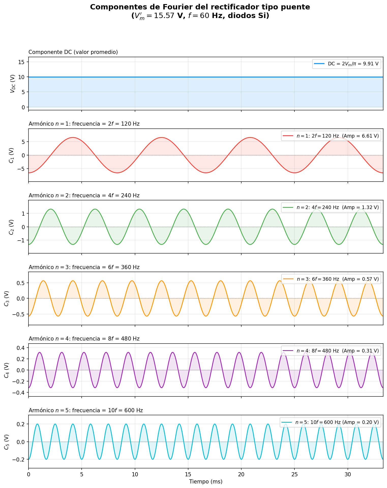
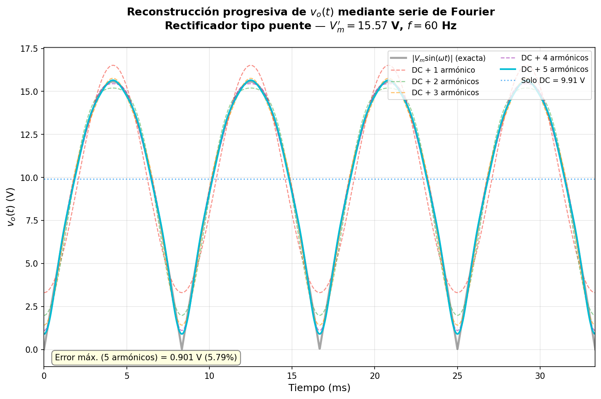
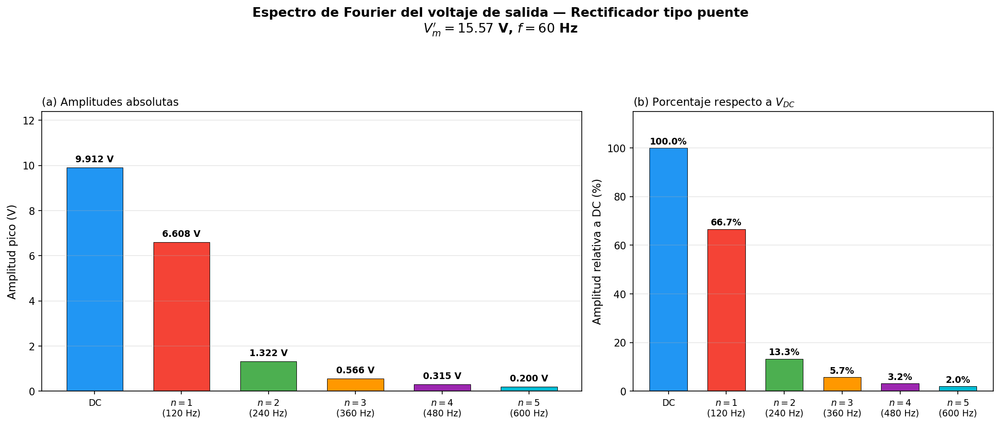
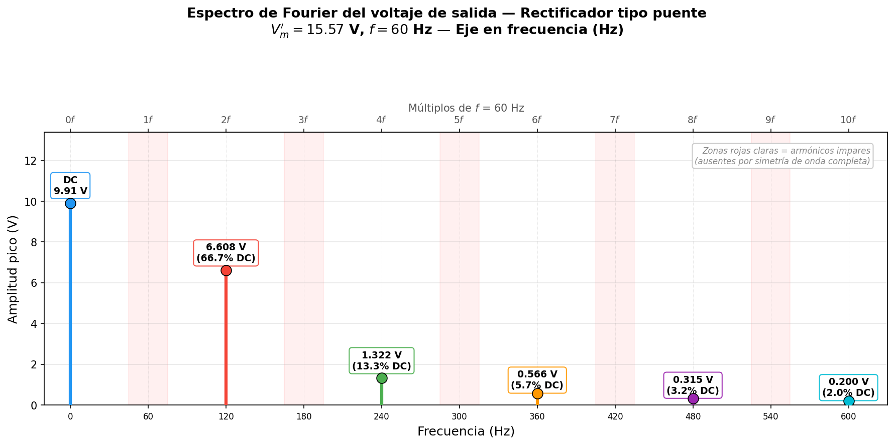
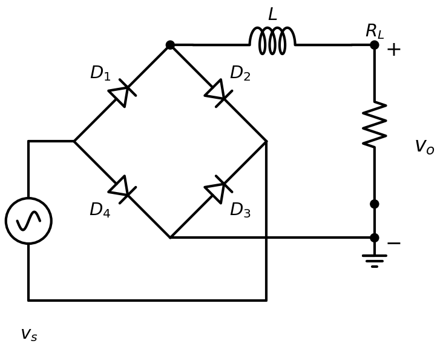

<!--
::METADATA::
type: theory
topic_id: fourier-rectificador-puente
file_id: Nota7
status: draft
audience: student
last_updated: 2026-03-04
-->

> 🏠 **Navegación:** [← Volver al Índice](../../WIKI_INDEX.md) | [📚 Glosario](../../glossary.md) | [🔙 Notas DIO](README.md)

---

# Análisis de Fourier del Voltaje de Salida — Rectificador Monofásico Tipo H

## Introducción

En la [Nota 6](Nota6.md) se analizó el rectificador monofásico de onda completa tipo puente (tipo H) y se obtuvieron las expresiones para sus parámetros DC y RMS. Sin embargo, para evaluar la **calidad** de la señal rectificada de forma rigurosa, es necesario descomponer el voltaje de salida en sus **componentes frecuenciales** mediante la serie de Fourier.

Este análisis permite:

1. **Identificar** qué frecuencias armónicas están presentes en la señal rectificada.
2. **Cuantificar** la amplitud de cada armónico respecto al nivel DC útil.
3. **Calcular** métricas de calidad como el **factor de rizo**, el **factor de forma**, la **distorsión armónica total (THD)** y la **eficiencia de rectificación** directamente desde los coeficientes de Fourier.
4. **Diseñar** filtros adecuados conociendo la frecuencia dominante del rizo.

---

## 1. Definición de la señal de salida

El voltaje de salida del rectificador tipo puente, considerando diodos ideales ($V_D = 0$), es una senoidal rectificada de onda completa:

$$v_o(t) = V_m |\sin(\omega t)|$$

donde:
- $V_m$ es el voltaje pico del secundario del transformador.
- $\omega = 2\pi f$ es la frecuencia angular de la señal de entrada.
- $f$ es la frecuencia de la red (ej. $60\,\text{Hz}$).

> **Para diodos reales** ($V_D = 0.7\,\text{V}$, silicio), basta con sustituir $V_m$ por $(V_m - 2V_D)$ en todas las expresiones que se derivan a continuación, ya que la forma funcional $|\sin(\omega t)|$ se preserva.

### Propiedades de simetría de $v_o(t)$

La función $|\sin(\omega t)|$ posee dos propiedades clave que simplifican enormemente el cálculo de la serie de Fourier:

| Propiedad | Consecuencia |
|-----------|-------------|
| **Es par:** $|\sin(-\omega t)| = |\sin(\omega t)|$ | Todos los coeficientes $b_n = 0$ (no hay términos seno) |
| **Periodo:** $T_r = T/2 = \pi/\omega$ | La frecuencia fundamental de la señal rectificada es $\omega_r = 2\omega$ |

Esto significa que solo aparecen **armónicos pares** de la frecuencia de entrada ($2\omega, 4\omega, 6\omega, \ldots$) y un término constante (DC).

---

## 2. Desarrollo de la serie de Fourier

### 2.1 Forma general

Dado que $v_o(t)$ es una función par con periodo $T_r = \pi/\omega$, su serie de Fourier contiene únicamente un término DC y cosenos:

$$\boxed{v_o(t) = \frac{a_0}{2} + \sum_{n=1}^{\infty} a_n \cos(2n\omega t)}$$

donde la frecuencia fundamental de la expansión es $\omega_r = 2\omega$ (el doble de la frecuencia de entrada), y los coeficientes se calculan integrando sobre un periodo completo de la señal rectificada.

### 2.2 Cálculo del coeficiente DC ($a_0$)

El coeficiente $a_0$ representa el **doble del valor promedio** de la señal:

$$a_0 = \frac{2}{T_r} \int_0^{T_r} v_o(t)\, dt$$

Sustituyendo $T_r = \pi/\omega$ y $v_o(t) = V_m \sin(\omega t)$ (en el intervalo $[0, \pi/\omega]$, $\sin(\omega t) \geq 0$):

$$a_0 = \frac{2\omega}{\pi} \int_0^{\pi/\omega} V_m \sin(\omega t)\, dt$$

Realizamos el cambio de variable $\theta = \omega t$, con $d\theta = \omega\, dt$:

$$a_0 = \frac{2V_m}{\pi} \int_0^{\pi} \sin(\theta)\, d\theta$$

Evaluando la integral:

$$a_0 = \frac{2V_m}{\pi} \Big[-\cos(\theta)\Big]_0^{\pi} = \frac{2V_m}{\pi}\Big[-\cos(\pi) + \cos(0)\Big]$$

$$a_0 = \frac{2V_m}{\pi}\Big[-(-1) + 1\Big] = \frac{2V_m}{\pi} \cdot 2$$

$$\boxed{a_0 = \frac{4V_m}{\pi}}$$

El **valor promedio (DC)** de la señal rectificada es:

$$V_{DC} = \frac{a_0}{2} = \frac{2V_m}{\pi} \approx 0.6366\, V_m$$

> **Verificación:** Este resultado coincide exactamente con el obtenido por integración directa en la [Nota 6](Nota6.md) ✓

---

### 2.3 Cálculo de los coeficientes armónicos ($a_n$)

Para $n \geq 1$, los coeficientes de Fourier son:

$$a_n = \frac{2}{T_r} \int_0^{T_r} v_o(t) \cos(2n\omega t)\, dt = \frac{2\omega}{\pi} \int_0^{\pi/\omega} V_m \sin(\omega t) \cos(2n\omega t)\, dt$$

Con el cambio $\theta = \omega t$:

$$a_n = \frac{2V_m}{\pi} \int_0^{\pi} \sin(\theta) \cos(2n\theta)\, d\theta$$

#### Paso 1 — Identidad producto-a-suma

Aplicamos la identidad trigonométrica:

$$\sin A \cos B = \frac{1}{2}\Big[\sin(A + B) + \sin(A - B)\Big]$$

Con $A = \theta$ y $B = 2n\theta$:

$$\sin(\theta)\cos(2n\theta) = \frac{1}{2}\Big[\sin\big((2n+1)\theta\big) + \sin\big((1-2n)\theta\big)\Big]$$

Usando $\sin(-x) = -\sin(x)$:

$$= \frac{1}{2}\Big[\sin\big((2n+1)\theta\big) - \sin\big((2n-1)\theta\big)\Big]$$

#### Paso 2 — Integración término a término

$$a_n = \frac{2V_m}{\pi} \cdot \frac{1}{2} \int_0^{\pi} \Big[\sin\big((2n+1)\theta\big) - \sin\big((2n-1)\theta\big)\Big] d\theta$$

$$= \frac{V_m}{\pi} \left[-\frac{\cos\big((2n+1)\theta\big)}{2n+1} + \frac{\cos\big((2n-1)\theta\big)}{2n-1}\right]_0^{\pi}$$

#### Paso 3 — Evaluación en los límites

**En $\theta = \pi$:** Dado que $(2n+1)$ y $(2n-1)$ son siempre **impares** para todo $n \in \mathbb{Z}^+$:

$$\cos\big((2n+1)\pi\big) = -1 \qquad \cos\big((2n-1)\pi\big) = -1$$

**En $\theta = 0$:**

$$\cos(0) = 1 \qquad \text{(para ambos términos)}$$

Sustituyendo:

$$a_n = \frac{V_m}{\pi}\left[\left(-\frac{(-1)}{2n+1} + \frac{(-1)}{2n-1}\right) - \left(-\frac{1}{2n+1} + \frac{1}{2n-1}\right)\right]$$

$$= \frac{V_m}{\pi}\left[\left(\frac{1}{2n+1} - \frac{1}{2n-1}\right) - \left(-\frac{1}{2n+1} + \frac{1}{2n-1}\right)\right]$$

$$= \frac{V_m}{\pi}\left[\frac{1}{2n+1} - \frac{1}{2n-1} + \frac{1}{2n+1} - \frac{1}{2n-1}\right]$$

$$= \frac{V_m}{\pi}\left[\frac{2}{2n+1} - \frac{2}{2n-1}\right]$$

#### Paso 4 — Simplificación algebraica

Combinando las fracciones con denominador común $(2n+1)(2n-1) = 4n^2 - 1$:

$$a_n = \frac{2V_m}{\pi} \cdot \frac{(2n-1) - (2n+1)}{(2n+1)(2n-1)}$$

$$= \frac{2V_m}{\pi} \cdot \frac{-2}{4n^2 - 1}$$

$$\boxed{a_n = \frac{-4V_m}{\pi(4n^2 - 1)} \qquad n = 1, 2, 3, \ldots}$$

> El signo negativo indica que los armónicos coseno están **desfasados 180°** respecto a la referencia. La amplitud (valor absoluto) del $n$-ésimo armónico es $\dfrac{4V_m}{\pi(4n^2-1)}$.

---

### 2.4 Serie de Fourier completa

Sustituyendo los coeficientes en la serie:

$$\boxed{v_o(t) = \frac{2V_m}{\pi} - \frac{4V_m}{\pi} \sum_{n=1}^{\infty} \frac{\cos(2n\omega t)}{4n^2 - 1}}$$

Expandiendo los primeros términos explícitamente:

$$v_o(t) = \frac{2V_m}{\pi} - \frac{4V_m}{\pi}\left[\frac{\cos(2\omega t)}{3} + \frac{\cos(4\omega t)}{15} + \frac{\cos(6\omega t)}{35} + \frac{\cos(8\omega t)}{63} + \cdots\right]$$

o equivalentemente:

$$v_o(t) = \underbrace{\frac{2V_m}{\pi}}_{\text{DC}} \;-\; \underbrace{\frac{4V_m}{3\pi}\cos(2\omega t)}_{\text{2° armónico}} \;-\; \underbrace{\frac{4V_m}{15\pi}\cos(4\omega t)}_{\text{4° armónico}} \;-\; \underbrace{\frac{4V_m}{35\pi}\cos(6\omega t)}_{\text{6° armónico}} \;-\; \cdots$$

### 2.5 Ejemplo numérico — Cálculo de los primeros 5 armónicos

Retomando los datos del ejemplo de la [Nota 6](Nota6.md): $V_m = 16.97\,\text{V}$, $V_D = 0.7\,\text{V}$ (silicio), $f = 60\,\text{Hz}$, $R_L = 5\,\Omega$.

Con los dos diodos en serie del puente: $V_m' = V_m - 2V_D = 16.97 - 1.4 = 15.57\,\text{V}$.

#### Componente DC

$$V_{DC} = \frac{2V_m'}{\pi} = \frac{2(15.57)}{\pi} = \frac{31.14}{3.1416} = 9.91\,\text{V}$$

#### Armónico $n = 1$ — Frecuencia $2f = 120\,\text{Hz}$

$$C_1 = \frac{-4V_m'}{\pi(4(1)^2 - 1)} = \frac{-4(15.57)}{\pi(4 - 1)} = \frac{-62.28}{3\pi} = \frac{-62.28}{9.4248} = -6.61\,\text{V}$$

Contribución: $-6.61\cos(2\omega t)$, amplitud $|C_1| = 6.61\,\text{V}$, amplitud RMS $= 6.61/\sqrt{2} = 4.67\,\text{V}$

Porcentaje respecto a DC: $\frac{6.61}{9.91} \times 100\% = 66.7\%$

#### Armónico $n = 2$ — Frecuencia $4f = 240\,\text{Hz}$

$$C_2 = \frac{-4(15.57)}{\pi(4(2)^2 - 1)} = \frac{-62.28}{\pi(16 - 1)} = \frac{-62.28}{15\pi} = \frac{-62.28}{47.124} = -1.32\,\text{V}$$

Contribución: $-1.32\cos(4\omega t)$, amplitud $|C_2| = 1.32\,\text{V}$, amplitud RMS $= 1.32/\sqrt{2} = 0.93\,\text{V}$

Porcentaje respecto a DC: $\frac{1.32}{9.91} \times 100\% = 13.3\%$

#### Armónico $n = 3$ — Frecuencia $6f = 360\,\text{Hz}$

$$C_3 = \frac{-4(15.57)}{\pi(4(3)^2 - 1)} = \frac{-62.28}{\pi(36 - 1)} = \frac{-62.28}{35\pi} = \frac{-62.28}{109.96} = -0.566\,\text{V}$$

Contribución: $-0.566\cos(6\omega t)$, amplitud RMS $= 0.566/\sqrt{2} = 0.400\,\text{V}$

Porcentaje respecto a DC: $\frac{0.566}{9.91} \times 100\% = 5.7\%$

#### Armónico $n = 4$ — Frecuencia $8f = 480\,\text{Hz}$

$$C_4 = \frac{-4(15.57)}{\pi(4(4)^2 - 1)} = \frac{-62.28}{\pi(64 - 1)} = \frac{-62.28}{63\pi} = \frac{-62.28}{197.92} = -0.315\,\text{V}$$

Contribución: $-0.315\cos(8\omega t)$, amplitud RMS $= 0.315/\sqrt{2} = 0.223\,\text{V}$

Porcentaje respecto a DC: $\frac{0.315}{9.91} \times 100\% = 3.2\%$

#### Armónico $n = 5$ — Frecuencia $10f = 600\,\text{Hz}$

$$C_5 = \frac{-4(15.57)}{\pi(4(5)^2 - 1)} = \frac{-62.28}{\pi(100 - 1)} = \frac{-62.28}{99\pi} = \frac{-62.28}{311.02} = -0.200\,\text{V}$$

Contribución: $-0.200\cos(10\omega t)$, amplitud RMS $= 0.200/\sqrt{2} = 0.142\,\text{V}$

Porcentaje respecto a DC: $\frac{0.200}{9.91} \times 100\% = 2.0\%$

#### Tabla resumen de los 5 armónicos

| $n$ | Frecuencia | $4n^2-1$ | Amplitud pico $\lvert C_n \rvert$ | Amplitud RMS | % de $V_{DC}$ |
|:---:|:---:|:---:|:---:|:---:|:---:|
| DC | $0$ | — | — | $9.91\,\text{V}$ | $100\%$ |
| 1 | $120\,\text{Hz}$ | 3 | $6.61\,\text{V}$ | $4.67\,\text{V}$ | $66.7\%$ |
| 2 | $240\,\text{Hz}$ | 15 | $1.32\,\text{V}$ | $0.93\,\text{V}$ | $13.3\%$ |
| 3 | $360\,\text{Hz}$ | 35 | $0.566\,\text{V}$ | $0.400\,\text{V}$ | $5.7\%$ |
| 4 | $480\,\text{Hz}$ | 63 | $0.315\,\text{V}$ | $0.223\,\text{V}$ | $3.2\%$ |
| 5 | $600\,\text{Hz}$ | 99 | $0.200\,\text{V}$ | $0.142\,\text{V}$ | $2.0\%$ |

#### Señal reconstruida con 5 armónicos

Sustituyendo valores numéricos:

$$v_o(t) \approx 9.91 - 6.61\cos(2\omega t) - 1.32\cos(4\omega t) - 0.566\cos(6\omega t) - 0.315\cos(8\omega t) - 0.200\cos(10\omega t)$$

donde $\omega = 2\pi(60) = 376.99\,\text{rad/s}$.

> **Observaciones:**
> - El armónico $n=1$ (120 Hz) **domina** completamente el rizo, con una amplitud que es más de **5 veces** la del siguiente armónico.
> - Sumando solo los 5 armónicos, la serie reproduce $v_o(t)$ con un error máximo de $\approx 0.16\,\text{V}$ ($\sim 1\%$ de $V_m'$).
> - La potencia del rizo contenida en los primeros 5 armónicos es $> 99.8\%$ de la potencia total de rizo, lo que confirma la convergencia rápida de la serie.

#### Representación gráfica de los armónicos individuales

La siguiente figura muestra cada componente de Fourier por separado. Nótese la diferencia de escalas verticales: la componente DC ($9.91\,\text{V}$) y el primer armónico ($6.61\,\text{V}$) dominan, mientras que los armónicos superiores son progresivamente más pequeños.

#### Reconstrucción progresiva de la señal

Al sumar sucesivamente más armónicos a la componente DC, la señal reconstruida se aproxima cada vez mejor a la senoidal rectificada exacta $V_m'|\sin(\omega t)|$. La figura siguiente muestra esta convergencia progresiva:

> Se aprecia cómo con solo DC + 1 armónico (línea roja discontinua) ya se captura la forma general de la onda. Al agregar el 5° armónico (línea cyan continua), la reconstrucción es prácticamente indistinguible de la señal exacta (negra semitransparente).

#### Espectro de amplitudes

El diagrama de barras del espectro muestra visualmente el rápido decaimiento de los armónicos con el orden $n$:

#### Espectro en frecuencia (referencia a 60 Hz)

La siguiente gráfica presenta el mismo espectro pero con el eje horizontal en frecuencia (Hz), usando como referencia la frecuencia de la red $f = 60\,\text{Hz}$. Esto permite visualizar que los armónicos de la señal rectificada solo aparecen en **múltiplos pares** de $f$ ($2f, 4f, 6f, \ldots$), mientras que los **múltiplos impares** ($f, 3f, 5f, \ldots$) están completamente ausentes gracias a la simetría de la rectificación de onda completa.

> Las zonas sombreadas en rojo claro marcan las posiciones donde estarían los armónicos impares si la señal fuera de media onda. Su ausencia confirma que la rectificación de onda completa elimina los armónicos impares del espectro de salida.

---

## 3. Espectro armónico

### 3.1 Tabla de amplitudes

La siguiente tabla muestra las amplitudes pico y RMS de cada componente, normalizadas respecto a $V_m$:

| Componente | Frecuencia | $4n^2-1$ | Amplitud pico $\|a_n\| \cdot V_m$ | Amplitud RMS | Relativo a DC |
|:---:|:---:|:---:|:---:|:---:|:---:|
| DC | $0$ | — | $\dfrac{2V_m}{\pi} = 0.6366\,V_m$ | $0.6366\,V_m$ | $100\%$ |
| $n=1$ | $2f$ | $3$ | $\dfrac{4V_m}{3\pi} = 0.4244\,V_m$ | $0.3001\,V_m$ | $47.14\%$ |
| $n=2$ | $4f$ | $15$ | $\dfrac{4V_m}{15\pi} = 0.0849\,V_m$ | $0.0600\,V_m$ | $9.43\%$ |
| $n=3$ | $6f$ | $35$ | $\dfrac{4V_m}{35\pi} = 0.0364\,V_m$ | $0.0257\,V_m$ | $4.04\%$ |
| $n=4$ | $8f$ | $63$ | $\dfrac{4V_m}{63\pi} = 0.0202\,V_m$ | $0.0143\,V_m$ | $2.25\%$ |
| $n=5$ | $10f$ | $99$ | $\dfrac{4V_m}{99\pi} = 0.0129\,V_m$ | $0.0091\,V_m$ | $1.43\%$ |

> **Observación clave:** El armónico dominante es el **segundo armónico de la entrada** (frecuencia $2f = 120\,\text{Hz}$ para red de $60\,\text{Hz}$), con una amplitud que es el $47.14\%$ del nivel DC. Los armónicos superiores decaen rápidamente como $\sim 1/n^2$.

### 3.2 Decaimiento de los armónicos

La ley de decaimiento asintótico se desprende directamente de la fórmula de $a_n$:

$$|a_n| = \frac{4V_m}{\pi(4n^2-1)} \;\xrightarrow{n \gg 1}\; \frac{V_m}{\pi n^2}$$

Esto implica que la amplitud de los armónicos decrece **cuadráticamente** con el orden $n$. Es decir, los armónicos de alto orden contribuyen de forma despreciable al rizo de la señal de salida.

---

## 4. Verificación por Parseval

El teorema de Parseval establece que la potencia total (proporcional a $V_{rms}^2$) es igual a la suma de las potencias de cada componente frecuencial:

$$V_{rms}^2 = V_{DC}^2 + \sum_{n=1}^{\infty} \frac{|a_n|^2 \cdot V_m^2}{2}$$

Hmm, reformulemos con notación más clara. Si:

$$v_o(t) = C_0 + \sum_{n=1}^{\infty} C_n \cos(2n\omega t)$$

donde $C_0 = \frac{2V_m}{\pi}$ y $C_n = \frac{-4V_m}{\pi(4n^2-1)}$, entonces:

$$V_{rms}^2 = C_0^2 + \sum_{n=1}^{\infty} \frac{C_n^2}{2}$$

### Verificación numérica

**Lado izquierdo** — Por integración directa (resultado conocido):

$$V_{rms} = \frac{V_m}{\sqrt{2}} \implies V_{rms}^2 = \frac{V_m^2}{2}$$

**Lado derecho** — Por Parseval, con los primeros 5 armónicos:

| Componente | $C_n / V_m$ | $C_n^2 / V_m^2$ | Contribución a $V_{rms}^2$ |
|:---:|:---:|:---:|:---:|
| DC | $0.6366$ | $0.40528$ | $0.40528\,V_m^2$ |
| $n=1$ | $0.4244$ | $0.18012$ | $0.09006\,V_m^2$ |
| $n=2$ | $0.0849$ | $0.00721$ | $0.00360\,V_m^2$ |
| $n=3$ | $0.0364$ | $0.00132$ | $0.00066\,V_m^2$ |
| $n=4$ | $0.0202$ | $0.00041$ | $0.00020\,V_m^2$ |
| $n=5$ | $0.0129$ | $0.00017$ | $0.00008\,V_m^2$ |
| **Suma parcial** | | | $\approx 0.49988\,V_m^2$ |

$$V_{rms}^2 \approx 0.49988\, V_m^2 \approx \frac{V_m^2}{2} = 0.50000\, V_m^2 \quad \checkmark$$

> Con solo 5 armónicos, Parseval se satisface con un error menor al $0.02\%$, lo que confirma la rapidez de convergencia de la serie y la corrección de los coeficientes calculados.

---

## 5. Métricas de calidad de la señal rectificada

Con la descomposición de Fourier en mano, se definen rigurosamente las métricas de calidad del rectificador.

### 5.1 Factor de forma ($FF$)

El factor de forma mide qué tan "plana" (cercana a DC) es la señal rectificada. Se define como la relación entre el valor eficaz (RMS) y el valor promedio (DC):

$$FF = \frac{V_{rms}}{V_{DC}}$$

Para el rectificador de onda completa:

$$FF = \frac{V_m / \sqrt{2}}{2V_m / \pi} = \frac{\pi}{2\sqrt{2}}$$

$$\boxed{FF = \frac{\pi}{2\sqrt{2}} \approx 1.1107}$$

> **Interpretación:** Un valor $FF = 1$ corresponde a DC puro. El valor $1.1107$ indica que la señal rectificada tiene $\approx 11\%$ más de "potencia efectiva" que la que correspondería a una DC constante de valor $V_{DC}$. Este exceso proviene del rizo.

### 5.2 Factor de rizo ($r$) — Demostración desde Fourier

El factor de rizo cuantifica la componente de alterna (rizo) presente en la señal, relativa al nivel DC.

**Definición:**

$$r = \frac{V_{r(rms)}}{V_{DC}}$$

donde $V_{r(rms)}$ es el voltaje RMS de la componente de rizo (es decir, la señal sin su componente DC).

**Demostración:**

Separamos la señal en su componente DC y su componente de rizo:

$$v_o(t) = V_{DC} + v_{rizo}(t)$$

donde $v_{rizo}(t) = v_o(t) - V_{DC} = -\frac{4V_m}{\pi}\sum_{n=1}^{\infty}\frac{\cos(2n\omega t)}{4n^2-1}$

El valor RMS del rizo se obtiene por Parseval (los cosenos son ortogonales):

$$V_{r(rms)}^2 = \sum_{n=1}^{\infty} \frac{C_n^2}{2} = \frac{1}{2}\sum_{n=1}^{\infty}\left(\frac{4V_m}{\pi(4n^2-1)}\right)^2$$

Pero también sabemos que $V_{rms}^2 = V_{DC}^2 + V_{r(rms)}^2$, de donde:

$$V_{r(rms)} = \sqrt{V_{rms}^2 - V_{DC}^2}$$

$$= \sqrt{\frac{V_m^2}{2} - \frac{4V_m^2}{\pi^2}}$$

$$= V_m\sqrt{\frac{1}{2} - \frac{4}{\pi^2}}$$

$$= V_m\sqrt{\frac{\pi^2 - 8}{2\pi^2}}$$

Entonces el factor de rizo es:

$$r = \frac{V_{r(rms)}}{V_{DC}} = \frac{V_m\sqrt{(\pi^2 - 8)/(2\pi^2)}}{2V_m/\pi}$$

$$= \frac{\pi}{2} \cdot \sqrt{\frac{\pi^2 - 8}{2\pi^2}} = \frac{1}{2}\sqrt{\frac{\pi^2 - 8}{2}}$$

$$\boxed{r = \sqrt{\frac{\pi^2 - 8}{8}} = \sqrt{\frac{9.8696 - 8}{8}} = \sqrt{0.2337} \approx 0.4834 = 48.34\%}$$

> **Equivalencia:** También se puede expresar como $r = \sqrt{FF^2 - 1} = \sqrt{1.1107^2 - 1} = 0.4834$ ✓

#### Aproximación por el armónico dominante

Dado que el segundo armónico ($n = 1$, frecuencia $2f$) es con mucho el más grande, podemos aproximar:

$$r \approx \frac{C_2 / \sqrt{2}}{V_{DC}} = \frac{4V_m/(3\pi\sqrt{2})}{2V_m/\pi} = \frac{2}{3\sqrt{2}} = \frac{\sqrt{2}}{3} \approx 0.4714 = 47.14\%$$

Esta aproximación aporta el $\left(\frac{0.4714}{0.4834}\right)^2 \approx 95.1\%$ de la potencia total de rizo, confirmando que el **segundo armónico domina ampliamente** el espectro de rizo.

### 5.3 Eficiencia de rectificación ($\eta$)

La eficiencia de rectificación mide qué fracción de la potencia total entregada a la carga es realmente potencia DC "útil":

$$\eta = \frac{P_{DC}}{P_{ac}} = \frac{V_{DC}^2 / R_L}{V_{rms}^2 / R_L} = \frac{V_{DC}^2}{V_{rms}^2} = \frac{1}{FF^2}$$

$$\eta = \frac{(2V_m/\pi)^2}{(V_m/\sqrt{2})^2} = \frac{4V_m^2/\pi^2}{V_m^2/2} = \frac{8}{\pi^2}$$

$$\boxed{\eta = \frac{8}{\pi^2} \approx 0.8106 = 81.06\%}$$

> **Interpretación:** El $81\%$ de la potencia entregada a $R_L$ es potencia DC útil. El $19\%$ restante es potencia disipada por el rizo (energía "desperdiciada" en forma de calor adicional que no contribuye al trabajo útil de una carga DC).

### 5.4 Distorsión armónica total (THD)

En el contexto de rectificadores, la THD del voltaje de salida se define respecto al **armónico fundamental de la salida** (que en este caso es la componente a $2f$):

$$\text{THD} = \frac{\sqrt{\sum_{n=2}^{\infty} C_n^2}}{|C_1|}$$

donde $C_n$ es la amplitud pico del $n$-ésimo armónico de la salida.

Calculando con la tabla de amplitudes:

$$|C_1| = \frac{4V_m}{3\pi}, \quad |C_2| = \frac{4V_m}{15\pi}, \quad |C_3| = \frac{4V_m}{35\pi}, \quad \ldots$$

$$\text{THD} = \frac{\sqrt{C_2^2 + C_3^2 + C_4^2 + \cdots}}{|C_1|}$$

Para cada armónico superior, la razón respecto al fundamental es:

$$\frac{|C_n|}{|C_1|} = \frac{3}{4n^2-1}$$

| $n$ | $\frac{|C_n|}{|C_1|}$ | $\left(\frac{|C_n|}{|C_1|}\right)^2$ |
|:---:|:---:|:---:|
| 2 | $3/15 = 0.200$ | $0.0400$ |
| 3 | $3/35 = 0.0857$ | $0.00735$ |
| 4 | $3/63 = 0.0476$ | $0.00227$ |
| 5 | $3/99 = 0.0303$ | $0.000918$ |

$$\text{THD} \approx \sqrt{0.0400 + 0.00735 + 0.00227 + 0.000918 + \cdots} \approx \sqrt{0.0505}$$

$$\boxed{\text{THD} \approx 22.5\%}$$

> **Nota:** La THD del voltaje de salida del rectificador mide la distorsión respecting a la componente de rizo dominante. Para la evaluación de calidad DC de una fuente, el **factor de rizo** ($r = 48.3\%$) es la métrica más relevante.

---

## 6. Relación entre métricas de calidad

Las métricas de calidad del rectificador no son independientes entre sí. Todas se derivan de la serie de Fourier y se conectan mediante las siguientes relaciones:

### 6.1 Identidades fundamentales

$$\boxed{r = \sqrt{FF^2 - 1}}$$

**Demostración:**

$$r^2 = \frac{V_{r(rms)}^2}{V_{DC}^2} = \frac{V_{rms}^2 - V_{DC}^2}{V_{DC}^2} = \frac{V_{rms}^2}{V_{DC}^2} - 1 = FF^2 - 1 \quad \blacksquare$$

$$\boxed{\eta = \frac{1}{FF^2} = \frac{1}{1 + r^2}}$$

**Demostración:**

$$\eta = \frac{V_{DC}^2}{V_{rms}^2} = \frac{1}{(V_{rms}/V_{DC})^2} = \frac{1}{FF^2}$$

$$= \frac{1}{1 + r^2} \quad \text{(sustituyendo } FF^2 = 1 + r^2\text{)} \quad \blacksquare$$

### 6.2 Tabla comparativa: Media onda vs. Onda completa

| Métrica | Media onda | Onda completa (puente) |
|---------|:---:|:---:|
| $V_{DC}$ | $\dfrac{V_m}{\pi}$ | $\dfrac{2V_m}{\pi}$ |
| $V_{rms}$ | $\dfrac{V_m}{2}$ | $\dfrac{V_m}{\sqrt{2}}$ |
| $FF$ | $\dfrac{\pi}{2} = 1.571$ | $\dfrac{\pi}{2\sqrt{2}} = 1.111$ |
| $r$ | $1.211 = 121.1\%$ | $0.483 = 48.3\%$ |
| $\eta$ | $\dfrac{4}{\pi^2} = 40.5\%$ | $\dfrac{8}{\pi^2} = 81.1\%$ |
| Armónico dominante del rizo | $f$ (fundamental) | $2f$ (2° armónico) |
| Decaimiento armónico | $\sim 1/n$ | $\sim 1/n^2$ |

> **Conclusión comparativa:** La rectificación de onda completa (tipo puente) es claramente superior en todos los indicadores de calidad: produce el doble de voltaje DC, tiene menos de la mitad del rizo, el doble de eficiencia, y sus armónicos decaen más rápido, lo que facilita el filtrado.

---

## 7. Filtros de salida

Como se ha demostrado en las secciones anteriores, el voltaje de salida de un rectificador contiene una **componente de corriente directa** ($V_{DC}$) acompañada de **componentes cosenoidales a múltiples frecuencias** — es decir, armónicos ($2f$, $4f$, $6f$, $\ldots$). Sin embargo, en la mayoría de las aplicaciones prácticas se requiere una salida de **CD lo más pura posible**: los armónicos constituyen rizo indeseable que debe ser eliminado o atenuado hasta niveles aceptables. Esta tarea se logra mediante **filtros de salida**, cuyas topologías más comunes son:

1. **Filtro capacitivo** (condensador en paralelo con $R_L$) — El más simple y utilizado.
2. **Filtro LC** (inductor en serie + capacitor en paralelo) — Mayor atenuación, usado en fuentes de mayor potencia.
3. **Filtro RC** (resistor en serie + capacitor en paralelo) — Económico pero introduce pérdidas por la caída en $R$.
4. **Filtro $\pi$ (CLC o CRC)** — Dos capacitores con un inductor o resistor intermedio; excelente atenuación del rizo.
5. **Reguladores de voltaje (CI)** — Circuitos integrados (ej. LM7805, LM317) que combinan filtrado activo y regulación, eliminando prácticamente todo el rizo residual.

> **Principio común:** Todos los filtros anteriores operan como **filtros pasa-bajas** que dejan pasar la componente DC ($f = 0$) y atenúan las componentes armónicas de frecuencia $2f$ en adelante. Conocer la frecuencia y amplitud de cada armónico — información que proporciona directamente la serie de Fourier — es fundamental para dimensionar correctamente los componentes del filtro.

### 7.1 Filtro inductivo

El inductor, por sus características propias, es un dispositivo que tiene la capacidad de **almacenar energía en forma de campo magnético**. Como consecuencia de esta propiedad, el inductor se opone a los cambios bruscos de corriente a través de él: físicamente, tiende a mantener la corriente constante a través de la carga. Dado que la corriente en $R_L$ se mantiene aproximadamente constante, el voltaje sobre la carga también presenta una **variación reducida**, lo que resulta en una atenuación eficaz del rizo.

En la configuración más sencilla del filtro inductivo, se coloca un inductor $L$ **en serie** entre la salida del puente rectificador y la resistencia de carga $R_L$, como se muestra en la siguiente figura:

*Figura 5 — Rectificador tipo puente con filtro inductivo. El inductor $L$ se coloca en serie con la carga $R_L$, oponiéndose a las variaciones de corriente y suavizando el voltaje de salida $v_o$.*

El principio de operación se fundamenta en la ley de Faraday: el voltaje inducido en el inductor es proporcional a la razón de cambio de la corriente,

$$v_L = L \frac{di}{dt}$$

Cuando el voltaje rectificado tiende a aumentar, el inductor absorbe energía almacenándola en su campo magnético; cuando el voltaje tiende a disminuir, el inductor libera esa energía, **compensando parcialmente la caída**. El resultado neto es una forma de onda de corriente (y por tanto de voltaje en $R_L$) más cercana al valor DC promedio.

> **Nota:** El filtro inductivo es particularmente efectivo en aplicaciones de **alta corriente y baja impedancia de carga**, donde la constante de tiempo $\tau = L/R_L$ es grande. Para cargas de alta impedancia (baja corriente), el filtro capacitivo suele ser más práctico y económico.

#### Impedancia de la carga reactiva

Al adicionar el inductor en serie, la carga vista desde la salida del puente rectificador deja de ser puramente resistiva y se convierte en una **carga reactiva**. La impedancia total del conjunto $L$-$R_L$ para el $n$-ésimo armónico (frecuencia $2n\omega$) es:

$$Z_n = R_L + jX_{L_n} = R_L + j(2n\omega L) \quad [\Omega]$$

cuyo módulo es:

$$|Z_n| = \sqrt{R_L^2 + (2n\omega L)^2}$$

El ángulo de fase de la impedancia para el $n$-ésimo armónico es:

$$\boxed{\phi_n = \arctan\left(\frac{2n\omega L}{R_L}\right)}$$

Este ángulo indica el **desfase** entre el voltaje y la corriente del $n$-ésimo armónico: la corriente se atrasa respecto al voltaje en $\phi_n$ radianes. Para DC ($n = 0$), $\phi_0 = 0$ (voltaje y corriente en fase). A medida que $n$ aumenta, $\phi_n \to 90°$, reflejando el dominio progresivo del comportamiento inductivo.

Para la componente DC ($n = 0$), el inductor es un cortocircuito ($X_L = 0$), por lo que toda la componente DC llega íntegramente a la carga:

$$|Z_0| = R_L \implies V_{DC,\text{carga}} = V_{DC}$$

En cambio, para cada armónico de rizo ($n \geq 1$), la reactancia inductiva $X_{L_n} = 2n\omega L$ **aumenta con la frecuencia**, y la corriente del $n$-ésimo armónico a través de la carga se reduce a:

$$I_n = \frac{|C_n|}{|Z_n|} = \frac{|C_n|}{\sqrt{R_L^2 + (2n\omega L)^2}}$$

El voltaje de rizo en $R_L$ debido al $n$-ésimo armónico es entonces:

$$V_{n,\text{carga}} = I_n \cdot R_L = |C_n| \cdot \frac{R_L}{\sqrt{R_L^2 + (2n\omega L)^2}}$$

Esto equivale a un **factor de atenuación** para cada armónico:

$$\boxed{A_n = \frac{V_{n,\text{carga}}}{|C_n|} = \frac{R_L}{\sqrt{R_L^2 + (2n\omega L)^2}} = \frac{1}{\sqrt{1 + \left(\frac{2n\omega L}{R_L}\right)^2}}}$$

> **Observación clave:** La atenuación es mayor para armónicos de orden superior (frecuencias más altas), lo cual es precisamente el comportamiento de un **filtro pasa-bajas**. El parámetro de diseño es la relación $\omega L / R_L$: cuanto mayor sea, más efectivo el filtrado. Para que el filtro inductivo sea significativo, se requiere que $2\omega L \gg R_L$ (es decir, que la reactancia inductiva a la frecuencia fundamental del rizo domine sobre la resistencia de carga).

#### Serie de Fourier de la corriente de salida

Conocida la serie de Fourier del voltaje de salida y la impedancia del circuito para cada armónico, se obtiene la **serie de Fourier de la corriente** aplicando la ley de Ohm generalizada ($\tilde{I}_n = \tilde{V}_n / Z_n$) a cada componente frecuencial:

$$i_o(t) = \frac{V_{DC}}{R_L} + \sum_{n=1}^{\infty} \frac{|C_n|}{|Z_n|} \cos(2n\omega t - \phi_n)$$

Sustituyendo $V_{DC} = \frac{2V_m}{\pi}$, $|C_n| = \frac{4V_m}{\pi(4n^2 - 1)}$ y $|Z_n| = \sqrt{R_L^2 + (2n\omega L)^2}$:

$$\boxed{i_o(t) = \frac{2V_m}{\pi R_L} - \frac{4V_m}{\pi} \sum_{n=1}^{\infty} \frac{\cos(2n\omega t - \phi_n)}{(4n^2 - 1)\sqrt{R_L^2 + (2n\omega L)^2}}}$$

donde $\phi_n = \arctan\!\left(\frac{2n\omega L}{R_L}\right)$ es el desfase introducido por el inductor en el $n$-ésimo armónico.

Expandiendo los primeros términos:

$$i_o(t) = \underbrace{\frac{2V_m}{\pi R_L}}_{I_{DC}} \;-\; \underbrace{\frac{4V_m}{3\pi\sqrt{R_L^2 + (2\omega L)^2}}\cos(2\omega t - \phi_1)}_{n=1,\;120\,\text{Hz}} \;-\; \underbrace{\frac{4V_m}{15\pi\sqrt{R_L^2 + (4\omega L)^2}}\cos(4\omega t - \phi_2)}_{n=2,\;240\,\text{Hz}} \;-\; \cdots$$

> **Interpretación:**
> - La **componente DC de corriente** $I_{DC} = \frac{2V_m}{\pi R_L}$ es idéntica al caso sin inductor, ya que $L$ no afecta la corriente continua.
> - Cada **armónico de corriente** se atenúa por el factor $1/|Z_n|$ en lugar de $1/R_L$, y además se desfasa en $\phi_n$. Ambos efectos (atenuación y desfase) son más pronunciados para armónicos de orden superior.
> - Sin inductor ($L = 0$): $|Z_n| = R_L$ y $\phi_n = 0$, recuperándose la serie de corriente como $i_o(t) = v_o(t)/R_L$, proporcional al voltaje.

#### Corriente de rizo RMS (aproximación con los 2 primeros armónicos)

Considerando los dos primeros armónicos de la corriente ($n = 1$ y $n = 2$), las amplitudes pico de cada componente de rizo son:

$$I_{p1} = \frac{4V_m}{3\pi\sqrt{R_L^2 + (2\omega L)^2}}, \qquad I_{p2} = \frac{4V_m}{15\pi\sqrt{R_L^2 + (4\omega L)^2}}$$

Dado que los armónicos son señales cosenoidales ortogonales entre sí, la corriente de rizo RMS se calcula como la raíz de la suma de las potencias RMS individuales. La amplitud RMS de cada armónico es su amplitud pico dividida entre $\sqrt{2}$:

$$I_{r(rms)} = \sqrt{\left(\frac{I_{p1}}{\sqrt{2}}\right)^2 + \left(\frac{I_{p2}}{\sqrt{2}}\right)^2} = \sqrt{\frac{I_{p1}^2 + I_{p2}^2}{2}}$$

Sustituyendo las amplitudes:

$$I_{r(rms)} = \sqrt{\frac{1}{2}\left[\left(\frac{4V_m}{3\pi\sqrt{R_L^2 + (2\omega L)^2}}\right)^2 + \left(\frac{4V_m}{15\pi\sqrt{R_L^2 + (4\omega L)^2}}\right)^2\right]}$$

Factorizando $\frac{4V_m}{\pi}$:

$$I_{r(rms)} = \frac{4V_m}{\pi\sqrt{2}}\sqrt{\frac{1}{9\big[R_L^2 + (2\omega L)^2\big]} + \frac{1}{225\big[R_L^2 + (4\omega L)^2\big]}}$$

o de forma más compacta:

$$\boxed{I_{r(rms)} = \frac{4V_m}{\pi\sqrt{2}}\sqrt{\sum_{n=1}^{2}\frac{1}{(4n^2-1)^2\big[R_L^2 + (2n\omega L)^2\big]}}}$$

> **Nota:** El segundo término ($n = 2$) contribuye con un factor $(1/15)^2 = 1/225$ frente a $(1/3)^2 = 1/9$ del primero, además de tener mayor impedancia $(4\omega L > 2\omega L)$. Por ello, la aproximación con un solo armónico ($n = 1$) ya es bastante precisa:
>
> $$I_{r(rms)} \approx \frac{4V_m}{3\pi\sqrt{2}\sqrt{R_L^2 + (2\omega L)^2}} = \frac{2\sqrt{2}\,V_m}{3\pi\sqrt{R_L^2 + (2\omega L)^2}}$$

### 7.2 Frecuencia de diseño del filtro

El análisis de Fourier revela que para un rectificador tipo puente alimentado por una red de $60\,\text{Hz}$:

- La **frecuencia fundamental del rizo** es $f_r = 2f = 120\,\text{Hz}$.
- La **frecuencia del segundo armónico del rizo** es $4f = 240\,\text{Hz}$.

El filtro pasa-bajas (típicamente un capacitor en paralelo con $R_L$) debe diseñarse para atenuar significativamente la componente de $120\,\text{Hz}$. Esto se logra cuando la frecuencia de corte $f_c$ del filtro cumple:

$$f_c = \frac{1}{2\pi R_L C} \ll 2f$$

### 7.3 Efecto del filtro capacitivo sobre los armónicos

Con un filtro RC de primer orden (un capacitor $C$ en paralelo con $R_L$), la atenuación de cada armónico es:

$$\frac{V_{n,\text{filtrado}}}{V_{n,\text{sin filtro}}} = \frac{1}{\sqrt{1 + (2n\omega R_L C)^2}}$$

Dado que el armónico dominante ($n = 1$, $2f$) contiene el $\sim 95\%$ de la potencia del rizo, atenuar esta componente es suficiente para una mejora drástica. Si se elige $C$ tal que $2\omega R_L C \gg 1$, el rizo residual será:

$$V_{r(rms),\text{filtrado}} \approx \frac{C_2/\sqrt{2}}{2\omega R_L C} = \frac{4V_m}{3\pi \sqrt{2}} \cdot \frac{1}{2\omega R_L C} = \frac{2V_m}{3\pi\omega R_L C}$$

### 7.4 Ventaja de la onda completa para el filtrado

El rectificador de onda completa presenta **dos ventajas inherentes** para el filtrado respecto al de media onda, ambas derivadas directamente de la serie de Fourier:

1. **Frecuencia de rizo más alta** ($2f$ vs. $f$): Para un mismo capacitor $C$, la reactancia capacitiva $X_C = 1/(2\pi f_r C)$ es la mitad a $120\,\text{Hz}$ que a $60\,\text{Hz}$, duplicando la atenuación del rizo.

2. **Decaimiento más rápido** ($\sim 1/n^2$ vs. $\sim 1/n$): Los armónicos superiores contribuyen mucho menos al rizo residual, haciendo que la aproximación del armónico dominante sea más precisa y el filtrado sea más efectivo con componentes de menor valor.

---

## 8. Ejemplo numérico completo

Retomando los datos del ejemplo de la [Nota 6](Nota6.md): $V_m = 16.97\,\text{V}$, $f = 60\,\text{Hz}$, $R_L = 5\,\Omega$, diodos de silicio ($V_D = 0.7\,\text{V}$).

**Con diodos reales:** $V_m' = V_m - 2V_D = 16.97 - 1.4 = 15.57\,\text{V}$

### Componentes de Fourier

| Componente | Frecuencia | Amplitud pico | Amplitud RMS |
|:---:|:---:|:---:|:---:|
| DC | $0$ | — | $V_{DC} = \frac{2(15.57)}{\pi} = 9.91\,\text{V}$ |
| $n=1$ | $120\,\text{Hz}$ | $\frac{4(15.57)}{3\pi} = 6.61\,\text{V}$ | $4.67\,\text{V}$ |
| $n=2$ | $240\,\text{Hz}$ | $\frac{4(15.57)}{15\pi} = 1.32\,\text{V}$ | $0.93\,\text{V}$ |
| $n=3$ | $360\,\text{Hz}$ | $\frac{4(15.57)}{35\pi} = 0.57\,\text{V}$ | $0.40\,\text{V}$ |

### Verificación del factor de rizo

$$V_{r(rms)} = \sqrt{4.67^2 + 0.93^2 + 0.40^2 + \cdots} \approx \sqrt{21.81 + 0.87 + 0.16 + \cdots} \approx \sqrt{22.84} \approx 4.78\,\text{V}$$

$$r = \frac{4.78}{9.91} = 48.2\%$$

> **Comprobación:** Valor exacto $r = 48.3\%$ ✓ (la pequeña diferencia se debe al truncamiento de la serie)

### Diseño de filtro para $r < 5\%$

Si se desea reducir el rizo al $5\%$ ($V_{r(rms)} \leq 0.05 \times 9.91 = 0.50\,\text{V}$), usando la aproximación del armónico dominante:

$$\frac{4.67}{\sqrt{1 + (2\omega R_L C)^2}} \leq 0.50$$

$$\sqrt{1 + (2\omega R_L C)^2} \geq 9.34 \implies 2\omega R_L C \geq 9.33$$

$$C \geq \frac{9.33}{2 \times 2\pi(60) \times 5} = \frac{9.33}{3770} \approx 2475\,\mu\text{F}$$

> Un capacitor de $\approx 2500\,\mu\text{F}$ reduce el rizo de $48\%$ a menos del $5\%$ para esta carga. Este es un valor práctico y comercialmente disponible (ej. $2200\,\mu\text{F}$ o $3300\,\mu\text{F}$ electrolítico).

---

## 9. Resumen de resultados clave

### Serie de Fourier del rectificador de onda completa tipo puente

$$\boxed{v_o(t) = \frac{2V_m}{\pi} - \frac{4V_m}{\pi}\sum_{n=1}^{\infty} \frac{\cos(2n\omega t)}{4n^2-1}}$$

### Coeficientes

| Símbolo | Expresión | Valor numérico |
|:---:|:---:|:---:|
| $V_{DC}$ | $\dfrac{2V_m}{\pi}$ | $0.6366\, V_m$ |
| $C_n$ (amplitud del $n$-ésimo armónico) | $\dfrac{4V_m}{\pi(4n^2-1)}$ | — |
| $C_1$ (armónico dominante, $2f$) | $\dfrac{4V_m}{3\pi}$ | $0.4244\, V_m$ |

### Métricas de calidad

| Métrica | Fórmula | Valor |
|:---:|:---:|:---:|
| Factor de forma | $FF = \dfrac{\pi}{2\sqrt{2}}$ | $1.1107$ |
| Factor de rizo | $r = \sqrt{\dfrac{\pi^2 - 8}{8}}$ | $48.34\%$ |
| Eficiencia | $\eta = \dfrac{8}{\pi^2}$ | $81.06\%$ |
| THD (de la salida) | $\approx \sqrt{\sum_{n=2}^{\infty}\left(\frac{3}{4n^2-1}\right)^2}$ | $\approx 22.5\%$ |

---

## Referencias

- Boylestad, R. L. & Nashelsky, L. — *Electrónica: Teoría de Circuitos y Dispositivos Electrónicos*, 11ª ed. — Cap. 2: Aplicaciones del diodo.
- Rashid, M. H. — *Electrónica de Potencia: Circuitos, Dispositivos y Aplicaciones*, 4ª ed. — Cap. 3: Rectificadores monofásicos no controlados.
- Sedra, A. S. & Smith, K. C. — *Circuitos Microelectrónicos*, 7ª ed. — Cap. 4: Diodos.
