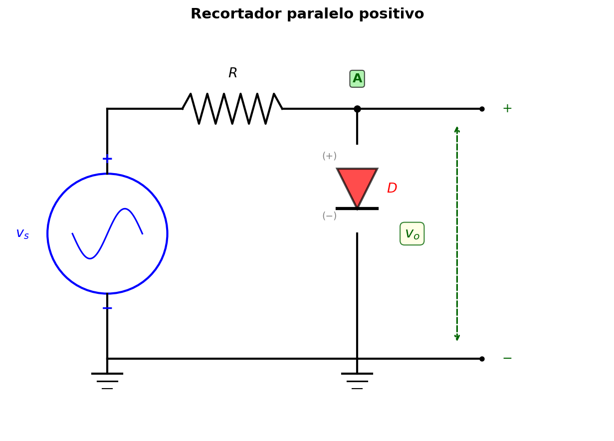
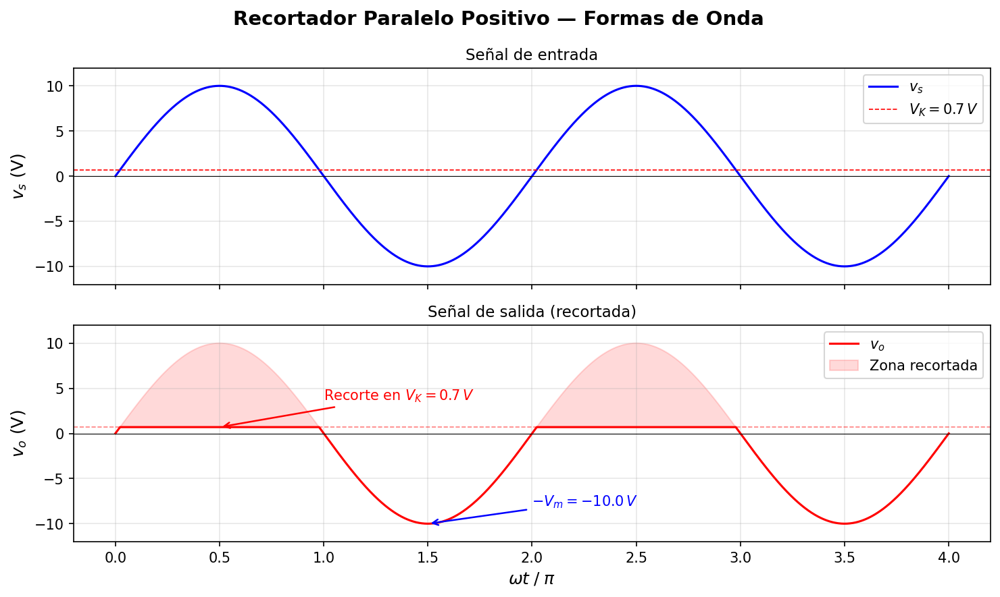
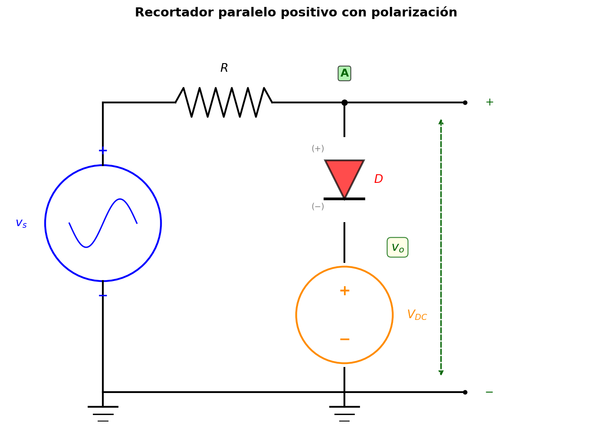
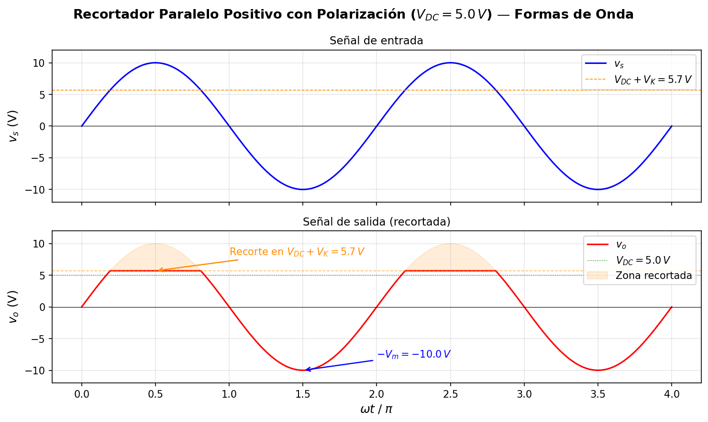
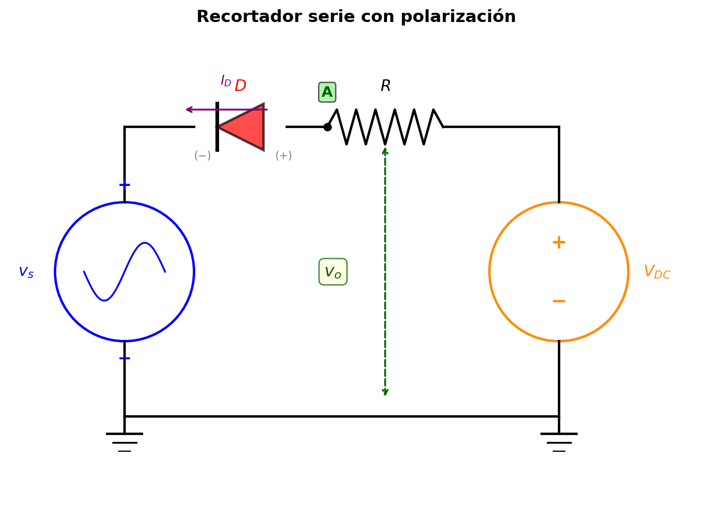
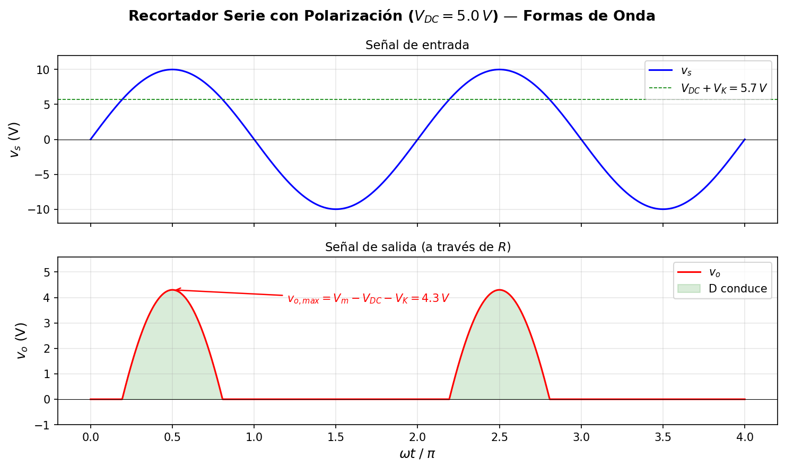
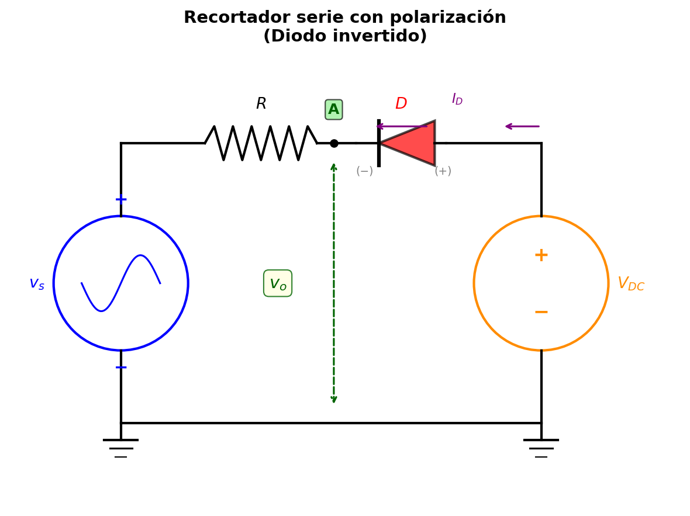
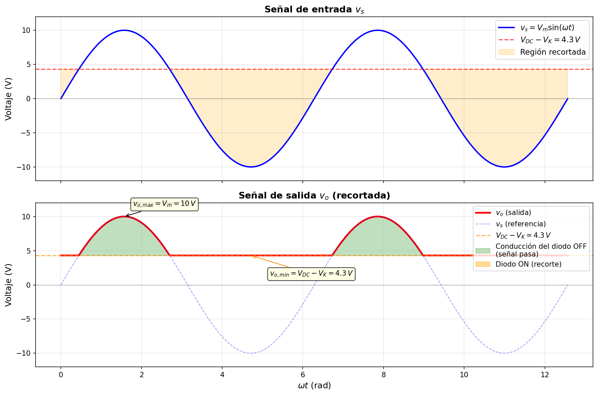

# Recortadores (Circuitos Limitadores)

## Concepto

Un **recortador** (también llamado *clipper* o circuito limitador) es un circuito que **interrumpe, limita o recorta** una porción de la señal de salida, impidiendo que esta supere un determinado nivel de voltaje. En esencia, el recortador "corta" los picos de la señal que exceden un umbral definido por el circuito.

La señal de entrada puede ser cualquier función periódica; sin embargo, para efectos prácticos y de análisis, se utiliza como función de entrada una **señal senoidal** dada por:

$$v_s = V_m \sin(\omega t)$$

donde:
- $V_m$ es la amplitud máxima de la señal,
- $\omega = 2\pi f$ es la frecuencia angular,
- $t$ es el tiempo.

---

## Recortadores más comunes

El tipo más básico es el **recortador paralelo positivo**, en el que un diodo se conecta en paralelo con la salida y una resistencia en serie limita la corriente. Cuando la señal de entrada supera el voltaje de umbral del diodo ($V_K \approx 0.7\,V$ para silicio), el diodo entra en conducción y fija la salida a $V_K$, recortando los picos positivos.

### Esquemático — Recortador paralelo positivo

**Funcionamiento:**
- **Semiciclo positivo** ($v_s > V_K$): el diodo $D$ conduce y la salida queda fijada en $v_o \approx V_K$. La resistencia $R$ absorbe la diferencia de voltaje.
- **Semiciclo negativo** ($v_s \leq V_K$): el diodo $D$ no conduce (circuito abierto) y la señal pasa sin alteración: $v_o \approx v_s$.

### Formas de onda

En la gráfica se observa cómo la señal de salida $v_o$ reproduce fielmente la señal de entrada $v_s$ durante la porción negativa del ciclo, pero queda **limitada a $V_K$** cada vez que $v_s$ intenta superar ese nivel. La zona sombreada en rojo indica la región de la señal que es recortada por la acción del diodo.

---

## Recortador paralelo positivo con polarización (biased clipper)

Cuando se agrega una **fuente de voltaje DC** ($V_{DC}$) en serie con el diodo —con terminal negativa a tierra y terminal positiva conectada al ánodo del diodo—, se obtiene un **recortador polarizado**. Esta fuente desplaza el nivel de recorte hacia arriba, permitiendo controlar con precisión a qué voltaje se limita la señal de salida.

### Esquemático — Recortador paralelo positivo con polarización

### Análisis del circuito

**Condición de conducción del diodo:**

El diodo $D$ conduce cuando la tensión en su ánodo (nodo A) supera la suma del voltaje de la fuente de polarización $V_{DC}$ más el voltaje de umbral $V_K$ del diodo:

$$v_o > V_{DC} + V_K$$

**Nivel de recorte:**

$$V_{recorte} = V_{DC} + V_K$$

Para un diodo de silicio ($V_K = 0.7\,V$) y una fuente de polarización $V_{DC} = 5\,V$:

$$V_{recorte} = 5 + 0.7 = 5.7\,V$$

### Funcionamiento por semiciclo

| Condición | Estado del diodo | Voltaje de salida |
|-----------|-----------------|-------------------|
| $v_s > V_{DC} + V_K$ | **Conduce** (cortocircuito) | $v_o = V_{DC} + V_K$ |
| $v_s \leq V_{DC} + V_K$ | **No conduce** (circuito abierto) | $v_o = v_s$ |

- **Cuando $v_s > V_{DC} + V_K$:** El diodo entra en conducción. La corriente fluye a través de $R$, $D$ y $V_{DC}$ hacia tierra. La salida $v_o$ queda fijada (*clamped*) en $V_{DC} + V_K$, y la resistencia $R$ absorbe el excedente: $v_R = v_s - (V_{DC} + V_K)$.
- **Cuando $v_s \leq V_{DC} + V_K$:** El diodo está en corte (circuito abierto). No fluye corriente por la rama del diodo, por lo que $v_o = v_s$ (la señal pasa sin alteración).

### Características teóricas del recortador polarizado

1. **Voltaje máximo de salida:** $v_{o,\max} = V_{DC} + V_K$
2. **Voltaje mínimo de salida:** $v_{o,\min} = -V_m$ (la señal negativa pasa completa)
3. **Voltaje pico inverso del diodo (PIV):** Ocurre cuando $v_s = -V_m$; el diodo soporta:

$$\text{PIV} = V_m + V_{DC}$$

4. **Corriente máxima por el diodo:** Se produce cuando $v_s = V_m$:

$$I_{D,\max} = \frac{V_m - (V_{DC} + V_K)}{R}$$

5. **Efecto de $V_{DC}$:** Al incrementar $V_{DC}$, el nivel de recorte sube, permitiendo que una mayor porción de la señal positiva atraviese sin alteración. Si $V_{DC} + V_K > V_m$, el diodo nunca conduce y la salida es idéntica a la entrada.

6. **Caso particular $V_{DC} = 0$:** Se reduce al recortador simple sin polarización, donde el nivel de recorte es simplemente $V_K$.

### Formas de onda

En la gráfica se observa que la señal de salida $v_o$ sigue fielmente a $v_s$ hasta alcanzar el nivel $V_{DC} + V_K = 5.7\,V$, a partir del cual queda **limitada**. La zona sombreada en naranja representa la porción de la señal recortada por la acción combinada del diodo y la fuente de polarización. La señal negativa pasa intacta hasta $-V_m$.

---

## Recortador serie con polarización

En esta configuración, el diodo y la fuente de polarización se encuentran **en serie** con la señal de entrada, y la salida $v_o$ se mide a través de la resistencia de carga $R$. A diferencia del recortador paralelo (que limita la salida a un valor fijo), el recortador serie **elimina** por completo la porción de la señal que no supera el umbral de conducción del diodo.

**Topología del circuito:** La terminal positiva de la fuente AC se conecta al ánodo del diodo; el cátodo se conecta a un extremo de $R$; el otro extremo de $R$ se conecta a la terminal positiva de $V_{DC}$; y la terminal negativa de $V_{DC}$ se conecta a la terminal negativa de la fuente AC (referencia común).

### Esquemático — Recortador serie con polarización

### Análisis del circuito

**Condición de conducción del diodo:**

El diodo $D$ conduce cuando el voltaje de la fuente AC supera la suma de la fuente de polarización y el voltaje de umbral:

$$v_s > V_{DC} + V_K$$

**Aplicando KVL al lazo** (cuando el diodo conduce):

$$v_s = V_K + v_o + V_{DC}$$

Despejando la salida:

$$v_o = v_s - V_{DC} - V_K$$

**Cuando el diodo no conduce** ($v_s \leq V_{DC} + V_K$): no circula corriente → no hay caída en $R$ → $v_o = 0$.

### Funcionamiento por semiciclo

| Condición | Estado del diodo | Voltaje de salida |
|-----------|-----------------|-------------------|
| $v_s > V_{DC} + V_K$ | **Conduce** | $v_o = v_s - V_{DC} - V_K$ |
| $v_s \leq V_{DC} + V_K$ | **No conduce** | $v_o = 0$ |

### Características teóricas del recortador serie

1. **Voltaje máximo de salida:**

$$v_{o,\max} = V_m - V_{DC} - V_K$$

Para $V_m = 10\,V$, $V_{DC} = 5\,V$, $V_K = 0.7\,V$:

$$v_{o,\max} = 10 - 5 - 0.7 = 4.3\,V$$

2. **Voltaje mínimo de salida:** $v_{o,\min} = 0\,V$ (el diodo simplemente deja de conducir).

3. **Voltaje pico inverso del diodo (PIV):** Ocurre cuando $v_s = -V_m$:

$$\text{PIV} = V_m + V_{DC}$$

4. **Corriente máxima por el diodo:** Se produce cuando $v_s = V_m$:

$$I_{D,\max} = \frac{V_m - V_{DC} - V_K}{R}$$

5. **Ángulo de conducción:** El diodo conduce solo durante el intervalo de $\omega t$ en que $V_m \sin(\omega t) > V_{DC} + V_K$. El ángulo de inicio de conducción es:

$$\theta_{on} = \arcsin\left(\frac{V_{DC} + V_K}{V_m}\right)$$

6. **Diferencia clave con el recortador paralelo:** El recortador serie **elimina** la señal debajo del umbral (la salida es cero), mientras que el paralelo **preserva** la señal y solo recorta los picos que exceden el umbral.

### Formas de onda

En la gráfica se observa que la señal de salida $v_o$ es **cero** mientras $v_s$ permanece por debajo de $V_{DC} + V_K = 5.7\,V$. Solo cuando $v_s$ supera ese umbral, el diodo conduce y la salida reproduce la señal desplazada: $v_o = v_s - V_{DC} - V_K$. La zona sombreada en verde indica los intervalos de conducción del diodo.

---

## Recortador serie con polarización (diodo invertido)

En esta variante, el diodo se conecta con su **cátodo** hacia la resistencia y su **ánodo** hacia la fuente de polarización $V_{DC}$. Esta orientación invierte la lógica de conducción respecto al recortador serie anterior: en lugar de eliminar la porción inferior de la señal, este circuito **fija un voltaje mínimo de salida** igual a $V_{DC} - V_K$, recortando la señal por debajo de ese nivel.

**Topología del circuito:** La terminal positiva de la fuente AC se conecta a un extremo de $R$; el otro extremo de $R$ se conecta al cátodo (terminal negativa) del diodo $D$; el ánodo (terminal positiva) del diodo se conecta a la terminal positiva de $V_{DC}$; y la terminal negativa de $V_{DC}$ se conecta a la terminal negativa de la fuente AC (referencia común a tierra).

### Esquemático — Recortador serie con diodo invertido

### Análisis del circuito

**Nodo de salida:** La tensión de salida $v_o$ se mide en el **nodo A** (unión entre $R$ y el cátodo de $D$) respecto a tierra.

**Condición de conducción del diodo:**

El diodo $D$ conduce (polarización directa) cuando $V_{ánodo} > V_{cátodo}$, es decir:

$$V_{DC} > V_A$$

Cuando el diodo está apagado (no conduce), no circula corriente por $R$ y el nodo A queda al potencial de la fuente:

$$V_A = v_s \quad \text{(sin caída en } R \text{)}$$

Por lo tanto, el diodo conduce cuando:

$$v_s < V_{DC} - V_K$$

**Cuando el diodo conduce** (diodo ideal con $V_D = V_K$):

$$V_A = V_{DC} - V_K \implies v_o = V_{DC} - V_K$$

**Cuando el diodo NO conduce** ($v_s \geq V_{DC} - V_K$):

$$v_o = v_s$$

### Funcionamiento por semiciclo

| Condición | Estado del diodo | Voltaje de salida |
|-----------|-----------------|-------------------|
| $v_s \geq V_{DC} - V_K$ | **No conduce** (circuito abierto) | $v_o = v_s$ |
| $v_s < V_{DC} - V_K$ | **Conduce** (polarización directa) | $v_o = V_{DC} - V_K$ |

**Nivel de recorte:**

$$V_{recorte} = V_{DC} - V_K$$

Para $V_{DC} = 5\,V$ y $V_K = 0.7\,V$:

$$V_{recorte} = 5 - 0.7 = 4.3\,V$$

### Verificación por KVL

**Cuando el diodo conduce**, la corriente $I_D$ fluye desde el ánodo ($V_{DC}^+$) a través del diodo hasta el cátodo (nodo A), luego a través de $R$ hacia $v_s^+$, por la fuente AC de $+$ a $-$, y de regreso a tierra ($V_{DC}^-$):

$$V_{DC} - V_K - I_D R - v_s = 0$$

$$I_D = \frac{V_{DC} - V_K - v_s}{R}$$

Para que el diodo conduzca se requiere $I_D > 0$, lo que confirma la condición $v_s < V_{DC} - V_K$.

### Características teóricas

1. **Voltaje máximo de salida:**

$$v_{o,\max} = V_m$$

La señal positiva pasa sin alteración, ya que el diodo está en corte.

2. **Voltaje mínimo de salida:**

$$v_{o,\min} = V_{DC} - V_K$$

La señal queda fijada en este nivel cuando el diodo conduce.

Para $V_m = 10\,V$, $V_{DC} = 5\,V$, $V_K = 0.7\,V$:

$$v_{o,\min} = 5 - 0.7 = 4.3\,V$$

3. **Voltaje pico inverso del diodo (PIV):** Ocurre cuando $v_s = V_m$ (máxima tensión inversa sobre el diodo):

$$\text{PIV} = V_m - V_{DC} = 10 - 5 = 5\,V$$

4. **Corriente máxima por el diodo:** Se produce cuando $v_s = -V_m$ (mínimo de la señal):

$$I_{D,\max} = \frac{V_{DC} - V_K + V_m}{R} = \frac{5 - 0.7 + 10}{R} = \frac{14.3}{R}$$

Para $R = 1\,k\Omega$: $I_{D,\max} = 14.3\,mA$

5. **Ángulo de corte:** El diodo deja de conducir cuando $v_s = V_{DC} - V_K$. El ángulo en que la señal cruza ese nivel es:

$$\theta_{off} = \arcsin\left(\frac{V_{DC} - V_K}{V_m}\right) = \arcsin\left(\frac{4.3}{10}\right) \approx 25.5°$$

El diodo conduce para $\omega t$ fuera del rango $[\theta_{off},\, 180° - \theta_{off}]$ en cada ciclo positivo, y durante **todo** el semiciclo negativo.

6. **Diferencia clave con el recortador serie anterior:** El recortador serie anterior (diodo directo) **elimina** la señal debajo del umbral ($v_o = 0$). Esta variante con diodo invertido **reemplaza** la señal debajo del umbral con un nivel DC constante ($v_o = V_{DC} - V_K$), preservando una salida no nula en todo momento.

### Formas de onda

En la gráfica se observa que la señal de salida $v_o$ sigue fielmente a $v_s$ mientras esta se encuentra por encima de $V_{DC} - V_K = 4.3\,V$. Cuando $v_s$ desciende por debajo de ese nivel, el diodo entra en conducción y **fija la salida** en $4.3\,V$, impidiendo que descienda más. La zona sombreada en naranja indica la porción de la señal recortada, mientras que la zona verde muestra los intervalos donde la señal pasa sin alteración.
