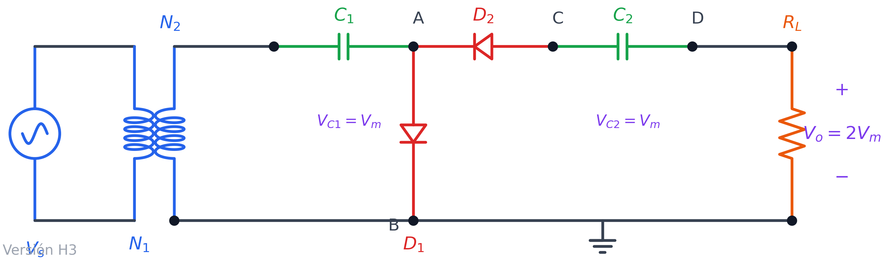
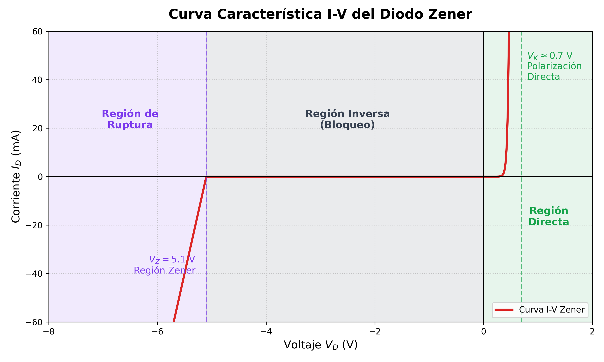
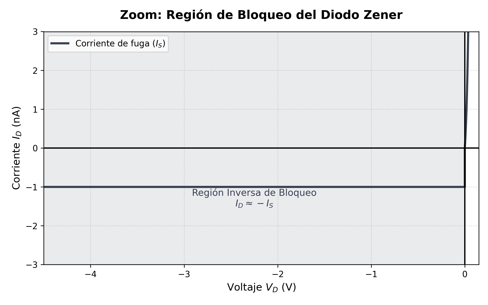
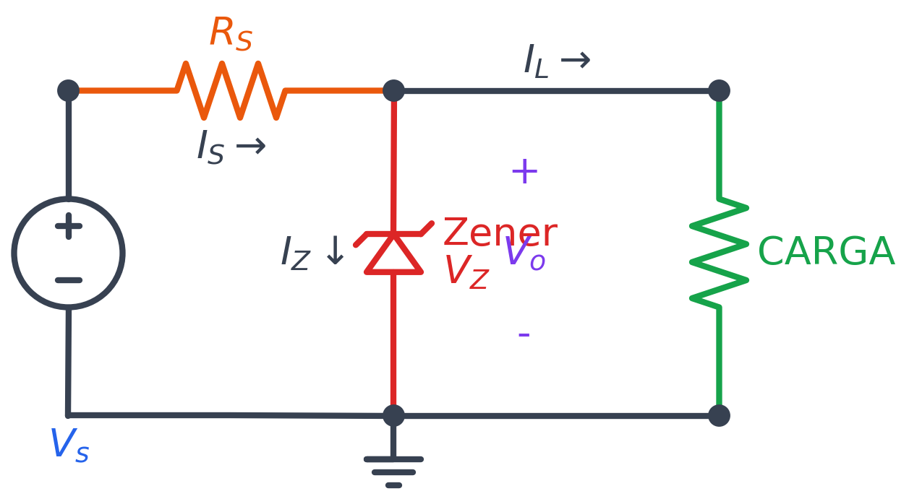

# Multiplicadores de Voltaje

## Introducción

Los **multiplicadores de voltaje** son circuitos rectificadores especializados cuyo objetivo es elevar un voltaje de corriente alterna (AC) y convertirlo a corriente continua (DC). A diferencia de los rectificadores convencionales que producen un voltaje de salida aproximadamente igual al valor pico de la entrada, los multiplicadores de voltaje pueden generar voltajes DC que son múltiplos enteros del voltaje pico de entrada.

Estos circuitos son particularmente útiles en aplicaciones donde se requieren altos voltajes DC pero con corrientes relativamente bajas, como en fuentes de alimentación para tubos de rayos catódicos (CRT), multiplicadores de fotocopiadoras, generadores de rayos X portátiles, y sistemas de ignición electrónica.

---

## Duplicador de Voltaje

El **duplicador de voltaje** es el multiplicador más simple y básico. Su circuito produce un voltaje de salida DC aproximadamente igual al doble del voltaje pico de la señal de entrada AC.

### Circuito del Duplicador de Voltaje

*Figura: Circuito de un duplicador de voltaje con dos diodos y dos capacitores (Versión H3).*

El circuito consiste en:
- **Fuente de AC:** Proporciona el voltaje de entrada sinusoidal $V_{in}(t) = V_m \sin(\omega t)$
- **Diodos D1 y D2:** Rectifican la señal en diferentes semiciclos
- **Capacitores C1 y C2:** Almacenan carga y mantienen el voltaje DC
- **Carga $R_L$:** Resistencia de carga conectada a la salida

### Funcionamiento Detallado

El análisis del circuito se divide en múltiples intervalos durante los ciclos de la señal de entrada. A continuación se describe el comportamiento completo del duplicador de voltaje:

#### **Intervalo 1: Primer Semiciclo Positivo** ($0 \leq \omega t \leq \frac{\pi}{2}$)

Durante el primer semiciclo positivo de la señal de entrada:

1. **Estado de los diodos:**
   - El **diodo D1** se polariza directamente (conduce)
   - El **diodo D2** se polariza inversamente (bloqueado)

2. **Comportamiento del circuito:**
   - El capacitor **C1** se carga a través de D1 desde el secundario del transformador
   - El voltaje en C1 alcanza aproximadamente el valor pico de entrada: $V_{C1} \approx V_m$
   - Como D2 está bloqueado, no hay corriente hacia C2 ni hacia la carga
   - **Voltaje de salida:** $V_o = 0$ (durante este intervalo inicial)

3. **Ecuación del capacitor C1:**
   $$V_{C1}(t) = V_m \sin(\omega t) \quad \text{con} \quad \lim_{\omega t \to \pi/2} V_{C1} = V_m$$

#### **Intervalo 2: Transición y Descarga Parcial** ($\frac{\pi}{2} \leq \omega t \leq \pi$)

Durante este intervalo de transición:

1. **Estado de los diodos:**
   - El **diodo D1** se apaga (polarización inversa)
   - El **diodo D2** se enciende (polarización directa)

2. **Condición de mantenimiento de carga en C1:**
   - Si el valor de $R_L$ es lo suficientemente grande tal que:
   $$R_L C_1 > \frac{1}{f}$$
   donde $f$ es la frecuencia de $V_s$, entonces el capacitor C1 tarda en descargarse a través de $R_L$ y el voltaje en C1 se mantiene aproximadamente en $V_m$.

3. **Inicio de conducción de D2:**
   - A medida que $V_s$ disminuye y se hace negativo, D2 comienza a conducir
   - El voltaje en el nodo central (ánodo de D2) es la suma del voltaje de C1 y el voltaje del secundario

#### **Intervalo 3: Semiciclo Negativo y Carga de C2** ($\pi \leq \omega t \leq \frac{3\pi}{2}$)

Durante el semiciclo negativo completo:

1. **Estado de los diodos:**
   - El **diodo D1** permanece apagado por completo (polarización inversa)
   - El **diodo D2** conduce plenamente (polarización directa)

2. **Comportamiento del circuito:**
   - La polaridad de $V_s$ es negativa, con valor máximo $-V_m$
   - El voltaje almacenado en C1 ($V_m$) se suma algebraicamente al voltaje del secundario ($-V_m$)
   - Esta combinación genera un voltaje total disponible en el ánodo de D2:
   $$V_{D2,\text{ánodo}} = V_{C1} + V_s = V_m + (-V_m \sin(\omega t))$$

3. **Carga del capacitor C2:**
   - El capacitor **C2** se carga a través de D2
   - El voltaje de salida $V_o$ es igual al voltaje en el capacitor C2
   - En el pico negativo ($\omega t = \frac{3\pi}{2}$), cuando $V_s = -V_m$:
   $$V_o = V_{C2} \approx V_m + V_m = 2V_m$$

4. **Ecuación del voltaje de salida:**
   $$V_o(\omega t = \frac{3\pi}{2}) = V_{C1} + |V_s|_{\text{pico}} = V_m + V_m = 2V_m$$

#### **Intervalo 4: Régimen Permanente** ($\omega t > \frac{3\pi}{2}$)

Después del primer ciclo completo, el circuito entra en régimen permanente:

1. **Semiciclos positivos subsecuentes** ($\frac{3\pi}{2} \leq \omega t \leq 2\pi$, $\frac{5\pi}{2} \leq \omega t \leq 3\pi$, ...):
   - D1 conduce y recarga C1 al valor $V_m$
   - D2 está bloqueado
   - C2 se descarga ligeramente a través de $R_L$, causando un **rizado** en la salida

2. **Semiciclos negativos subsecuentes** ($2\pi \leq \omega t \leq \frac{5\pi}{2}$, $3\pi \leq \omega t \leq \frac{7\pi}{2}$, ...):
   - D2 conduce y recarga C2 al valor $2V_m$
   - D1 está bloqueado
   - C1 mantiene su carga debido a la alta constante de tiempo $R_L C_1$

3. **Voltaje promedio de salida en régimen permanente:**
   $$V_{o,\text{DC}} \approx 2V_m - \frac{I_{\text{carga}}}{f \cdot C_2}$$

   Donde $I_{\text{carga}} = \frac{V_o}{R_L}$ es la corriente promedio en la carga.

### Análisis del Rizado de Salida

En condiciones reales con carga resistiva, el voltaje de salida presenta un **rizado** (ripple) debido a la descarga del capacitor C2 durante los semiciclos en que D2 está bloqueado.

**Amplitud del rizado:**
$$\Delta V_o \approx \frac{V_o}{f \cdot R_L \cdot C_2}$$

**Voltaje de rizado pico a pico:**
$$V_{\text{rizado,pp}} = \frac{I_{\text{carga}}}{f \cdot C_2}$$

Para minimizar el rizado, se requiere:
- Capacitores de **gran capacitancia** (C1 y C2)
- Resistencia de carga **alta** (baja corriente de carga)
- Frecuencia de entrada **alta**

### Observaciones Importantes y Consideraciones de Diseño

1. **Rizado de salida:**
   - En condiciones reales con carga, el voltaje de salida presenta rizado debido a la descarga parcial de C2 durante los semiciclos en que D2 está bloqueado
   - La amplitud del rizado es inversamente proporcional a la capacitancia de C2 y a la resistencia de carga $R_L$

2. **Capacitancia requerida:**
   - Para minimizar el rizado, se requieren capacitores de gran capacitancia
   - Criterio de diseño: $R_L C_1 > \frac{1}{f}$ y $R_L C_2 > \frac{1}{f}$
   - Típicamente se usan valores de capacitancia en el rango de decenas a cientos de microfaradios

3. **Corriente de carga:**
   - El circuito funciona mejor con corrientes de carga bajas (alta impedancia de carga)
   - A mayor corriente de carga, mayor es la caída de voltaje y el rizado

4. **Regulación:**
   - El voltaje de salida disminuye al aumentar la corriente de carga debido a:
     - La impedancia interna de los capacitores
     - La caída de voltaje en los diodos durante la conducción
     - La descarga de los capacitores entre ciclos de recarga

5. **Voltaje inverso pico (PIV):**
   - Cada diodo debe soportar un voltaje inverso pico de al menos $2V_m$
   - Seleccionar diodos con $V_{PIV,\text{diodo}} \geq 2V_m$ con margen de seguridad

6. **Tiempo de establecimiento:**
   - El circuito requiere varios ciclos (típicamente 3-5 ciclos) para alcanzar el voltaje de salida estable $2V_m$
   - Durante el arranque, C1 y C2 se cargan progresivamente hasta sus valores finales

### Aplicaciones

- Fuentes de alto voltaje para instrumentación
- Sistemas de encendido electrónico
- Amplificación de voltaje en circuitos de radiofrecuencia
- Multiplicadores en cascada para obtener voltajes aún más altos (triplicadores, cuadruplicadores, etc.)

---

## Extensión a Multiplicadores de Mayor Orden

El principio del duplicador puede extenderse conectando más etapas en cascada para obtener triplicadores, cuadruplicadores y multiplicadores de voltaje de orden superior. Cada etapa adicional agrega aproximadamente $V_m$ al voltaje de salida total.

**Ecuación general para un multiplicador de orden n:**
$$V_o \approx n \cdot V_m$$

Donde $n$ es el número de etapas del multiplicador.

---

## Diodo Zener

El diodo Zener es un tipo especial de semiconductor diseñado para operar de forma continua y segura en la **región de ruptura inversa** (también conocida como región Zener o de avalancha). A diferencia de los diodos rectificadores comunes que se destruirían al alcanzar su voltaje de ruptura, el diodo Zener está fuertemente dopado para mantener un voltaje casi constante ($V_Z$) entre sus terminales cuando está polarizado en inversa y la corriente que lo atraviesa supera un valor mínimo ($I_{ZK}$).

Por esta característica de mantener una caída de tensión estable ante amplias variaciones de corriente, su principal aplicación es como **regulador de voltaje** o referencia de tensión en circuitos electrónicos.

Su curva característica I-V completa ilustra tres zonas principales: directa, inversa (bloqueo) y ruptura:

### Región de Bloqueo (Cercana a Cero)

Si ampliamos la zona de polarización inversa antes de llegar al voltaje de ruptura (por ejemplo, entre $0$ V y $-4.5$ V para un Zener de $-5.1$ V), observamos la **región de bloqueo**. En esta región, la corriente que atraviesa el Zener es extremadamente pequeña (corriente de fuga, $I_S$), típicamente en el orden de los nanoamperios (nA) o microamperios ($\mu$A). Es fundamental comprender que el diodo Zener no conduce corriente de forma ideal hasta que alcanza su voltaje de ruptura $V_Z$.

### Circuito Regulador Básico

Para utilizar el diodo Zener como regulador de voltaje, se emplea una configuración básica donde el diodo se polariza en inversa. 

En este diagrama:
- La **terminal negativa** (cátodo, la barrera recta) del diodo Zener se conecta a la resistencia limitadora $R_S$.
- La **terminal positiva** (ánodo, el triángulo) se conecta a la referencia o tierra (GND).
- Un bloque rectangular denominado **CARGA** se conecta en paralelo al diodo Zener, de forma que el voltaje regulado ($V_Z$) recae directamente sobre este bloque.
- La resistencia $R_S$ es esencial para limitar la corriente total que ingresa al circuito y absorber la diferencia de voltaje entre la fuente $V_s$ y $V_Z$.

### Análisis y Ecuaciones del Regulador Zener

Para diseñar y comprender adecuadamente el circuito regulador, es necesario analizarlo utilizando las leyes de Kirchhoff y el modelo equivalente del diodo Zener.

#### 1. Modelo del Diodo Zener Práctico
En la región de ruptura, un diodo Zener real no mantiene un voltaje perfectamente constante. Presenta una pequeña resistencia interna llamada **resistencia dinámica ($r_z$)**. Por lo tanto, se modela como una fuente de voltaje ideal ($V_{z0}$) en serie con $r_z$.
El voltaje total a través del Zener ($V_Z$ o $V_o$) a una corriente $I_Z$ dada es:

$$V_Z = V_{z0} + I_Z \cdot r_z$$

Si el fabricante proporciona el voltaje $V_Z$ medido a una corriente de prueba específica ($I_{ZT}$), podemos despejar el voltaje ideal de ruptura $V_{z0}$ intrínseco del componente:

$$V_{z0} = V_Z - I_{ZT} \cdot r_z$$

#### 2. Ecuaciones del Circuito (Leyes de Kirchhoff)
Observando el circuito regulador básico, aplicamos la **Ley de Corrientes de Kirchhoff (LKC)** en el nodo superior. La corriente total entregada por la fuente fluye a través de la resistencia $R_S$ y se divide entre el Zener y la carga:

$$I_S = I_Z + I_L$$

Aplicando la **Ley de Voltajes de Kirchhoff (LVK)** en la malla de entrada:

$$V_s - I_S \cdot R_S - V_o = 0$$

Despejando $R_S$ y sustituyendo $I_S$:

$$R_S = \frac{V_s - V_o}{I_Z + I_L}$$

Dado que el voltaje de salida recae en paralelo con el Zener ($V_o = V_Z = V_{z0} + I_Z \cdot r_z$), la ecuación completa de la resistencia limitadora se expresa como:

$$R_S = \frac{V_s - (V_{z0} + I_Z \cdot r_z)}{I_Z + I_L}$$

#### 3. Diseño por el "Peor Caso"
El valor de la resistencia limitadora $R_S$ debe elegirse de tal manera que garantice dos condiciones críticas: que el Zener mantenga la regulación bajo las condiciones más exigentes (no se apague), y que no se queme por exceso de corriente cuando las condiciones sean más favorables.

*   **Mantenimiento de la regulación (Cálculo de $R_S$):**
    El caso más crítico (el "peor caso" para que el Zener no abandone la región de avalancha) ocurre cuando la fuente entrega su **voltaje mínimo** ($V_{s(\min)}$) y simultáneamente la carga exige su **corriente máxima** ($I_{L(\max)}$). En este escenario, la corriente por el Zener decae a su nivel más bajo. Para asegurar su funcionamiento, se le debe asignar una corriente mínima de seguridad $I_{z(\min)}$. 
    Sustituyendo estas condiciones extremas en la ecuación general obtenemos la fórmula fundamental de diseño:

    $$R_S = \frac{V_{s(\min)} - V_{z0} - r_z \cdot I_{z(\min)}}{I_{z(\min)} + I_{L(\max)}}$$

*   **Verificación de Potencia Máxima:**
    El Zener experimentará la mayor corriente (y por ende, disipará más calor) cuando el voltaje de entrada sea **máximo** ($V_{s(\max)}$) y la carga se desconecte o demande la **corriente mínima** ($I_{L(\min)} = 0$). En este caso, toda la corriente sobrante debe ser absorbida por el Zener:

    $$I_{z(\max)} \approx \frac{V_{s(\max)} - V_Z}{R_S}$$

    La potencia máxima disipada será $P_{Z(\max)} = V_Z \cdot I_{z(\max)}$. El componente comercial elegido debe soportar holgadamente esta potencia para no destruirse térmicamente.

### Ejemplo de Diseño: Regulador Zener

**Problema:**
Se requiere diseñar un regulador Zener para obtener un voltaje de salida de $7.5\text{ V}$. La alimentación $V_s$ varía entre $15\text{ V}$ y $25\text{ V}$, y la corriente de carga $I_L$ varía entre $0\text{ mA}$ y $15\text{ mA}$. El diodo Zener disponible tiene un voltaje $V_z = 7.5\text{ V}$ a una corriente de prueba $I_{ZT} = 20\text{ mA}$ y una resistencia dinámica $r_z = 10\ \Omega$. Encuentre el valor de la resistencia limitadora $R$.

**Solución:**

**Paso 1: Determinar el voltaje ideal del Zener ($V_{z0}$)**
Utilizando el modelo de circuito equivalente del Zener ($V_z = V_{z0} + I_Z \cdot r_z$), despejamos $V_{z0}$:
$$V_{z0} = V_z - I_{ZT} \cdot r_z$$
$$V_{z0} = 7.5\text{ V} - (20\text{ mA})(10\ \Omega) = 7.5\text{ V} - 0.2\text{ V} = 7.3\text{ V}$$

**Paso 2: Establecer la corriente mínima del Zener ($I_{z(\min)}$)**
Para asegurar que el Zener mantenga la regulación (que opere lejos de la región de codo o *knee*) durante las peores condiciones, asumimos una corriente mínima de seguridad. Una regla de oro común es asignar un valor cercano a un tercio de la corriente máxima de carga o un margen de $5\text{ mA}$. Elegiremos:
$$I_{z(\min)} = 5\text{ mA}$$

**Paso 3: Calcular el valor de la resistencia limitadora ($R$)**
La condición más crítica para mantener la regulación ocurre cuando el voltaje de entrada es mínimo ($V_{s(\min)} = 15\text{ V}$) y la corriente de carga es máxima ($I_{L(\max)} = 15\text{ mA}$). En este punto, la corriente por el Zener decaerá a su valor mínimo ($I_{z(\min)} = 5\text{ mA}$).

La corriente total mínima que debe suministrarse a través de $R$ será:
$$I_{S} = I_{z(\min)} + I_{L(\max)} = 5\text{ mA} + 15\text{ mA} = 20\text{ mA}$$

Aplicamos la fórmula para calcular $R$:
$$R = \frac{V_{s(\min)} - V_{z0} - r_z \cdot I_{z(\min)}}{I_{z(\min)} + I_{L(\max)}}$$
$$R = \frac{15\text{ V} - 7.3\text{ V} - (10\ \Omega)(0.005\text{ A})}{0.020\text{ A}}$$
$$R = \frac{15 - 7.3 - 0.05}{0.020} = \frac{7.65\text{ V}}{0.020\text{ A}} = 382.5\ \Omega$$

**Paso 4: Análisis del peor caso para la disipación de potencia (Comprobación extra)**
Para asegurar que el Zener no se queme, calculamos su corriente máxima. Esto sucede cuando $V_s$ es máximo ($25\text{ V}$) y la carga está desconectada ($I_L = 0\text{ mA}$):
$$I_{z(\max)} \approx \frac{V_{s(\max)} - V_z}{R} = \frac{25\text{ V} - 7.5\text{ V}}{382.5\ \Omega} \approx 45.7\text{ mA}$$
La potencia máxima disipada por el Zener será $P_{Z(\max)} \approx 7.5\text{ V} \times 45.7\text{ mA} \approx 343\text{ mW}$. Se recomienda utilizar un diodo Zener comercial capaz de disipar al menos $0.5\text{ W}$.

**Resultado:** 
Se debe utilizar una resistencia calculada de $R = 382.5\ \Omega$. *(En la práctica, se podría utilizar un valor comercial estándar cercano como $390\ \Omega$, verificando de nuevo que se cumpla la regulación en los extremos).*
