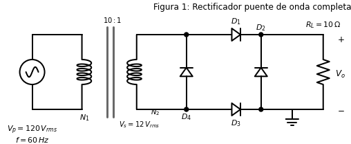
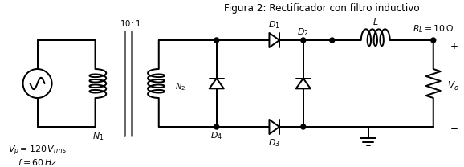
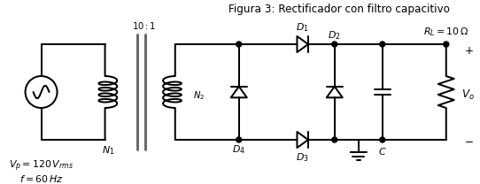

# INSTITUTO TECNOLÓGICO DE TOLUCA
## DIODOS y TRANSISTORES
## ELECTRÓNICA

**PRACTICA 1**
**Análisis e implementación de rectificadores monofásicos**

### OBJETIVO:
El objetivo de la práctica es que el alumno sea capaz de diseñar rectificadores monofásicos, así como realizar los cálculos de voltajes y corrientes promedio y rms, también la determinación de las formas de onda de voltaje y corriente mediante osciloscopio y finalmente diseñar los filtros pasivos adecuados para reducir rizo de salida.

### MATERIAL Y EQUIPO A UTILIZAR:

**Equipo:**
1. Osciloscopio digital con FFT
2. Sonda de efecto Hall para medición de corriente en osciloscopio

**Material:**
1. 4 - Diodos 1N 4005 o equivalente
2. 1 - Transformador reductor 120V primario 12V secundario a 2 o 3 Amp.
3. 1 - Tablilla protoboard
4. Alambre para conexión
5. Capacitor electrolítico e inductor con base al diseño.
6. Resistor de potencia de 10Ω/25W

---

### DESARROLLO:

1.- Para el circuito rectificador que se muestra en la figura-1, determine lo que se pide a continuación:

a).- Con base al valor del voltaje de alimentación de AC, calcule los parámetros de rendimiento: Vo(cd), Io(cd), Vo(rms), Io(rms), Vr(rizo), ID(prom), ID(rms), VPR, Po(CA), Po(CD) y f.

b).- Implemente el circuito para ser analizado en laboratorio como se muestra en la figura-1.

c).- De manera práctica mediante el osciloscopio, determine: las formas de onda del voltaje de entrada al rectificador, voltaje de salida del rectificador, midiendo sus valores promedio, rms, pico a pico, y frecuencia. (Cuando se mida la parte de AC no conectar los dos canales del osciloscopio).

d).- Posteriormente mediante la sonda de efecto Hall mida la corriente promedio y rms en la fuente de AC, así como su forma de onda.

e).- Posteriormente mida la corriente promedio y rms en la carga, así como su forma de onda con la sonda de efecto Hall.

f).- Utilizando la función de transformada rápida de Fourier, verifique el espectro de frecuencia en el osciloscopio, midiendo la frecuencia de los primeros cinco armónicos, verificando las frecuencias de los armónicos con el análisis visto en clase para el voltaje de salida.

g).- Mediante el osciloscopio, obtenga la forma de onda de la corriente de salida y posteriormente determine la serie de Fourier para la corriente de salida.

h).- Mediante el osciloscopio mida la corriente promedio y rms del secundario del transformador Is y su forma de onda.

i).- Agregue un inductor (Primario de un transformador) en serie con la resistencia de carga después de medirlo con el puente LCR a una frecuencia de 100HZ, tal y como se observa en la Figura-2. Posteriormente verifique la forma de onda de la corriente del secundario del transformador Is, comparándola con la corriente Is del inciso anterior.

j).- Con base a los valores de R y L prácticos, construya la serie de Fourier de la corriente de salida de manera analítica y posteriormente verifique la serie de manera práctica con el osciloscopio comparándola con el espectro del inciso g).

k).- Mida la corriente de rizo Ir(rms) mediante el osciloscopio y calcule Ir(rms) considerando el armónico de menor orden n=2, compare los valores y finalmente calcule el factor de rizo (FRi).

l).- Calcule un filtro capacitivo para reducir el rizo de salida a un valor <= 5%, también calcule el voltaje real de salida (Vo(cd)) y verifíquelo con el instrumento de medición.

m).- Adicione el filtro capacitivo como se muestra en la figura-3 y mediante el osciloscopio nuevamente obtenga el espectro de la serie de Fourier para el voltaje de salida y compárelo con el espectro del inciso f).

---

### Análisis de Circuitos y Mapas de Nodos

#### Figura 1: Rectificador puente monofásico de onda completa

* **Análisis:** Utiliza 4 diodos en configuración de puente de Graetz para rectificar ambos semiciclos de la onda senoidal, duplicando la frecuencia de salida a 120Hz y mejorando la eficiencia respecto a la media onda.
* **Nodos:**
    * **Nodo 0 (GND):** Ánodos de D3, D4 y terminal inferior de la Carga.
    * **Nodo 1 (Entrada AC - A):** Secundario superior, ánodo D1, cátodo D3.
    * **Nodo 2 (Entrada AC - B):** Secundario inferior, ánodo D2, cátodo D4.
    * **Nodo 3 (Salida V+):** Cátodos de D1, D2 y terminal superior de la Carga.

#### Figura 2: Rectificador tipo-H con filtro inductivo

* **Análisis:** Se añade un inductor (L1) en serie con la carga. El inductor se opone a los cambios bruscos de corriente, aplanando la forma de onda de la corriente que llega a la carga.
* **Nodos:**
    * **Nodo 0 (GND):** Ánodos de D3, D4, terminal inferior de R1, terminal inferior de V1 (0Vdc).
    * **Nodo 1 (Entrada AC - A):** V1 superior, ánodo D1, cátodo D3.
    * **Nodo 2 (Entrada AC - B):** V1 inferior, ánodo D2, cátodo D4.
    * **Nodo 3 (Salida Rectificada):** Cátodos D1, D2, entrada de L1.
    * **Nodo 4 (Salida Filtrada):** Salida de L1, terminal superior de R1.

#### Figura 3: Rectificador -H con filtro capacitivo

* **Análisis:** Se añade un capacitor (C1) en paralelo a la carga. Almacena energía en los picos de voltaje y la libera cuando el voltaje rectificado cae, reduciendo drásticamente el rizo de voltaje.
* **Nodos:**
    * **Nodo 0 (GND):** Ánodos D3, D4, terminal inferior de C1 y R1, terminal inferior de V1 (0Vdc).
    * **Nodo 1 (Entrada AC - A):** V1 superior, ánodo D1, cátodo D3.
    * **Nodo 2 (Entrada AC - B):** V1 inferior, ánodo D2, cátodo D4.
    * **Nodo 3 (Salida Filtrada V+):** Cátodos D1, D2, terminal superior de C1 y R1.

---
**Elaboró:** Ing. José Luís Ávila Gómez