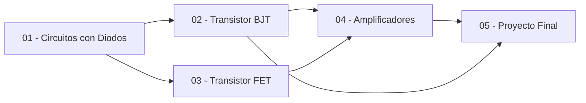

<!--
::METADATA::
type: index
topic_id: repo-readme
file_id: README
status: active
audience: both
last_updated: 2026-02-07
-->

# 📚 Diodos y Transistores

> **Repositorio de conocimiento estructurado** para la materia de Diodos y Transistores.  
> Organizado como un **Jardín Digital**: modular, interconectado y procesable por IA.

---

## 🧭 Navegación Rápida

| Para... | Ir a... |
|---------|---------|
| 📖 Estudiantes | [Guía de Estudio](00-META/study-guide.md) |
| 🤖 Asistentes IA | [Contrato IA](00-META/ia-contract.md) |
| 📋 Contenido completo | [Índice Wiki](WIKI_INDEX.md) |
| 📚 Definiciones | [Glosario](glossary.md) |
| 📋 Temario oficial | [Temario](Temario.md) |

---

## 📊 Módulos Disponibles

| # | Prefijo | Módulo | Estado | Subtemas |
|---|---------|--------|--------|----------|
| 01 | `DIO` | [Circuitos con Diodos](01-Circuitos-Diodos/00-Index.md) | 🔄 En progreso | Polarización, Rectificación, Recortadores, Sujetadores, Multiplicadores, Zener, Otros diodos |
| 02 | `BJT` | [Transistor Bipolar](02-Transistor-BJT/00-Index.md) | 📝 Pendiente | Características, Polarización (EC, BC, CC), Conmutación, Estabilidad |
| 03 | `FET` | [Transistor Unipolar](03-Transistor-FET/00-Index.md) | 📝 Pendiente | Polarización fija, Auto, Divisor voltaje, MOSFET, Redes combinadas |
| 04 | `AMP` | [Amplificadores](04-Amplificadores/00-Index.md) | 📝 Pendiente | Pequeña señal, Amplificador BJT, Amplificador JFET |
| 05 | `PRO` | [Proyecto Final](05-Proyecto-Final/00-Index.md) | 📝 Pendiente | Fuente con regulador transistorizado, Fuente con regulador CI |

---

## 🗺️ Mapa de Dependencias



---

## 🏗️ Arquitectura del Repositorio

Este repositorio sigue la **Plantilla de Arquitectura Modular Universal** (ver [Plantilla](Plantilla%20de%20Arquitectura%20Modular%20Universal.md)).

```
DIODOS-Y-TRANSISTORES/
├── 📄 README.md, WIKI_INDEX.md, glossary.md, Temario.md
├── 🎛️ 00-META/          → Centro de control (reglas, estándares, herramientas)
├── 📚 01-Circuitos-Diodos/  → Módulo 1: Aplicaciones con diodos
├── 📚 02-Transistor-BJT/    → Módulo 2: Transistor bipolar
├── 📚 03-Transistor-FET/    → Módulo 3: Transistor unipolar
├── 📚 04-Amplificadores/    → Módulo 4: Amplificadores BJT y FET
└── 📚 05-Proyecto-Final/    → Módulo 5: Diseño de fuente de alimentación
```

---

## 📖 Instrucciones

### Para Estudiantes
1. Consulta el [Temario](Temario.md) para ver los temas de la materia.
2. Navega al módulo de interés desde la tabla de arriba.
3. Dentro de cada subtema: `theory/` → `methods/` → `problems/` → `solutions/`.
4. Usa el [Glosario](glossary.md) para consultar definiciones.

### Para Asistentes IA
1. **Leer primero:** [Contrato IA](00-META/ia-contract.md).
2. Navegar a subtema vía `manifest.json`.
3. Consultar `_directives.md` del subtema.
4. Generar contenido siguiendo las reglas establecidas.
