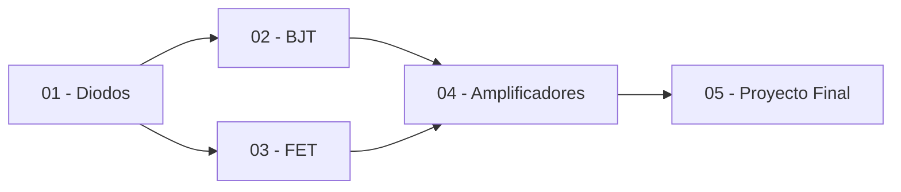

<!--
::METADATA::
type: index
topic_id: repo-readme
file_id: README
status: active
audience: both
last_updated: 2026-03-20
-->

# Diodos y Transistores

> **Repositorio de conocimiento estructurado** para la materia de Diodos y Transistores.
> Organizado como un **Jardín Digital**: modular, interconectado y procesable por IA.

---

## Navegación Rápida

| Para... | Ir a... |
|---------|---------|
| Estudiantes | [Guía de Estudio](00-meta/study-guide.md) |
| Asistentes IA | [AGENTS.md](AGENTS.md) |
| Contenido completo | [Índice Wiki](WIKI_INDEX.md) |
| Definiciones | [Glosario](glossary.md) |
| Temario oficial | [Temario](00-meta/temario.md) |
| Mapa estructural | [Repo Map](00-meta/repo-map.md) |

---

## Módulos Disponibles

| # | Prefijo | Módulo | Estado | Subtemas |
|---|---------|--------|--------|----------|
| 01 | `DIO` | [Circuitos con Diodos](topics/01-circuitos-diodos/) | review | Polarización, Rectificación, Recortadores, Sujetadores, Multiplicadores, Zener |
| 02 | `BJT` | [Transistor Bipolar](topics/02-transistor-bjt/) | draft | Características, Polarización (EC, BC, CC), Conmutación, Estabilidad |
| 03 | `FET` | [Transistor Unipolar](topics/03-transistor-fet/) | draft | Polarización fija, Auto, Divisor voltaje, MOSFET, Redes combinadas |
| 04 | `AMP` | [Amplificadores](topics/04-amplificadores/) | draft | Pequeña señal, Amplificador BJT, Amplificador JFET |
| 05 | `PRO` | [Proyecto Final](topics/05-proyecto-final/) | draft | Fuente con regulador transistorizado, Fuente con regulador CI |

---

## Mapa de Dependencias


```mermaid
graph LR
    A[01 - Diodos] --> B[02 - BJT]
    A --> C[03 - FET]
    B --> D[04 - Amplificadores]
    C --> D
    D --> E[05 - Proyecto Final]
```

---

## Requisitos de Software

- **Python 3.14.0** (Entorno virtual `.venv`)
- **Sistema (Linux/Codespaces):** `python3-tk`
- **Dependencias:**
  ```bash
  pip install numpy==2.4.2 matplotlib==3.10.8 schemdraw==0.22 pillow==12.1.0 packaging==26.0 python-dateutil==2.9.0.post0 six==1.17.0
  ```

### Opcionales para diagramas avanzados

- **Python (diagramas y simulacion):**
  ```bash
  pip install lcapy PySpice pygraphviz
  ```
- **Sistema (Debian/Codespaces):** `ngspice`, `graphviz`, `libgraphviz-dev`, `texlive-latex-base`, `texlive-pictures`, `dvisvgm`, `ghostscript`
- **Nota sobre LaTeX:** `pdflatex` es una dependencia del sistema (no una extension de VS Code). Las extensiones solo ayudan con edicion y previsualizacion.

---

## Ejecución de Herramientas

### Generación de Gráficas (Headless)

```bash
python 00-meta/tools/DIO-gen-curva-iv.py
```

### Calculadoras Interactivas (GUI)

```bash
export DISPLAY=:1
python "topics/01-circuitos-diodos/Notas/PRACTICA 1/practica1_calculadora.py"
```

*En Codespaces, usar el puerto "Desktop" o "noVNC" para la interfaz gráfica.*

---

## Arquitectura del Repositorio

```
DIODOS-Y-TRANSISTORES/
├── README.md, AGENTS.md, WIKI_INDEX.md, glossary.md
├── CHANGELOG.md              → Registro de cambios
├── 00-meta/                  → Centro de control
│   ├── repo-map.md           → Mapa estructural
│   ├── naming-conventions.md → Estándares de nomenclatura
│   ├── standards.md          → Directivas técnicas
│   ├── tools/                → Scripts Python
│   └── templates/            → Plantillas para futuros repos
├── topics/                   → Contenido educativo
│   ├── 01-circuitos-diodos/  → Módulo DIO
│   ├── 02-transistor-bjt/    → Módulo BJT
│   ├── 03-transistor-fet/    → Módulo FET
│   ├── 04-amplificadores/    → Módulo AMP
│   └── 05-proyecto-final/    → Módulo PRO
├── audits/                   → Sistema de auditorías
└── sandbox/                  → Zona de trabajo libre
```

---

## Instrucciones

### Para Estudiantes

1. Consulta el [Temario](00-meta/temario.md) para ver los temas de la materia.
2. Navega al módulo de interés desde la tabla de arriba.
3. En cada módulo: los subtemas están en `theory/`.
4. Complementa con `methods/`, `problems/` y `solutions/`.
5. Usa el [Glosario](glossary.md) para consultar definiciones.

### Para Asistentes IA

1. **Leer primero:** [AGENTS.md](AGENTS.md)
2. Consultar `manifest.json` del módulo objetivo.
3. Revisar `directives.md` del módulo.
4. Generar contenido siguiendo las reglas establecidas.
