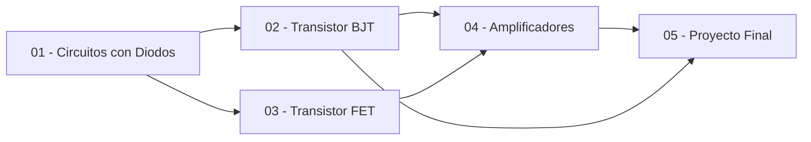

<!--
::METADATA::
type: index
topic_id: repo-readme
file_id: README
status: active
audience: both
last_updated: 2026-02-07
-->

# 📚 Diodos y Transistores

> **Repositorio de conocimiento estructurado** para la materia de Diodos y Transistores.  
> Organizado como un **Jardín Digital**: modular, interconectado y procesable por IA.

---

## 🧭 Navegación Rápida

| Para... | Ir a... |
|---------|---------|
| 📖 Estudiantes | [Guía de Estudio](00-META/study-guide.md) |
| 🤖 Asistentes IA | [Contrato IA](00-META/ia-contract.md) |
| 📋 Contenido completo | [Índice Wiki](WIKI_INDEX.md) |
| 📚 Definiciones | [Glosario](glossary.md) |
| 📋 Temario oficial | [Temario](Temario.md) |

---

## 📊 Módulos Disponibles

| # | Prefijo | Módulo | Estado | Subtemas |
|---|---------|--------|--------|----------|
| 01 | `DIO` | [Circuitos con Diodos](01-Circuitos-Diodos/00-Index.md) | 🔄 En progreso | Polarización, Rectificación, Recortadores, Sujetadores, Multiplicadores, Zener, Otros diodos |
| 02 | `BJT` | [Transistor Bipolar](02-Transistor-BJT/00-Index.md) | 📝 Pendiente | Características, Polarización (EC, BC, CC), Conmutación, Estabilidad |
| 03 | `FET` | [Transistor Unipolar](03-Transistor-FET/00-Index.md) | 📝 Pendiente | Polarización fija, Auto, Divisor voltaje, MOSFET, Redes combinadas |
| 04 | `AMP` | [Amplificadores](04-Amplificadores/00-Index.md) | 📝 Pendiente | Pequeña señal, Amplificador BJT, Amplificador JFET |
| 05 | `PRO` | [Proyecto Final](05-Proyecto-Final/00-Index.md) | 📝 Pendiente | Fuente con regulador transistorizado, Fuente con regulador CI |

---

## 🗺️ Mapa de Dependencias


```mermaid
graph LR
    A[01 - Circuitos con Diodos] --> B[02 - Transistor BJT]
    A --> C[03 - Transistor FET]
    B --> D[04 - Amplificadores]
    C --> D
    D --> E[05 - Proyecto Final]
    B --> E
```

---

## 🛠️ Requisitos de Software

Para ejecutar los scripts de generación de gráficas y las calculadoras interactivas, se requiere:

- **Python 3.14.0** (Versión actual del entorno `.venv`).
- **Dependencias del sistema (Linux/Codespaces):** `python3-tk` (necesario para interfaces gráficas `tkinter`).
- **Librerías de Python:**
  - `numpy==2.4.2`
  - `matplotlib==3.10.8`
  - `schemdraw==0.22`
  - `pillow==12.1.0`
  - `packaging==26.0`
  - `python-dateutil==2.9.0.post0`
  - `six==1.17.0`

- **Configuración del Entorno:**
  Se recomienda usar el `.venv` incluido. Si se requiere reinstalar las librerías manualmente, ejecute:
  ```bash
  pip install numpy==2.4.2 matplotlib==3.10.8 schemdraw==0.22 pillow==12.1.0 packaging==26.0 python-dateutil==2.9.0.post0 six==1.17.0
  ```

---

## 🚀 Ejecución de Herramientas

### Generación de Gráficas (Headless)
Los scripts en `00-META/tools/` generan imágenes PNG automáticamente:
```bash
python 00-META/tools/DIO-gen-curva-iv.py
```

### Calculadoras Interactivas (GUI)
Para herramientas con interfaz gráfica (como `practica1_calculadora.py`), es necesario configurar el display en entornos como GitHub Codespaces:
```bash
export DISPLAY=:1
python "01-Circuitos-Diodos/Notas/PRACTICA 1/practica1_calculadora.py"
```
*Nota: En Codespaces, use la característica de "Desktop" o "VNC" para interactuar con la ventana.*

---

## 🚀 Configuración para GitHub Codespaces

Este GitHub Codespace está configurado para operar como un espejo funcional del entorno local actual (Windows, Python 3.14.0), asegurando una paridad total durante el desarrollo. Se confirmó explícitamente que el entorno es compatible con la versión local.

### 1. Instalación del Intérprete y Dependencias del Sistema
El entorno corre sobre **Python 3.14.0** nativo de Linux y usa un entorno virtual (`.venv`) independiente. Se compiló el lenguaje y se instaló la dependencia crítica para poder utilizar librerías con interfaces de ventana u obtener outputs gráficos (`tk-dev` y `python3-tk`). Se configuró la variable de entorno para enviar la salida gráfica por el puerto VNC (`export DISPLAY=:1`).

### 2. Recreación del Entorno Virtual (.venv)
Se creó un entorno virtual nativo para Linux (`python3.14 -m venv .venv`) aislado del sistema para evitar conflictos, preinstalando explícitamente las versiones maestras:
```bash
pip install numpy==2.4.2 matplotlib==3.10.8 schemdraw==0.22 pillow==12.1.0 packaging==26.0 python-dateutil==2.9.0.post0 six==1.17.0
```

### 3. Solución de Problemas de GUI visual (Calculadoras interactivas)
Si se ejecutan scripts interactivos y existe algún problema al mostrar las ventanas interactivas:

1. Activa tu entorno virtual con `.venv`: \`source .venv/bin/activate\`
2. Asegúrate de configurar el contexto de visualización X11 de la terminal: \`export DISPLAY=:1\`
3. Ve a la pestaña **Puertos (Ports)** dentro de VS Code.
4. Abre la URL en el navegador del puerto **Desktop** o **noVNC** (usualmente asociado al 6080).
5. Lanza el script. La calculadora será renderizada de inmediato en ese escritorio del navegador:
   ```bash
   python "01-Circuitos-Diodos/Notas/PRACTICA 1/practica1_calculadora.py"
   ```

---

## 🏗️ Arquitectura del Repositorio

Este repositorio sigue la **Plantilla de Arquitectura Modular Universal** (ver [Plantilla](Plantilla%20de%20Arquitectura%20Modular%20Universal.md)).

```
DIODOS-Y-TRANSISTORES/
├── 📄 README.md, WIKI_INDEX.md, glossary.md, Temario.md
├── 🎛️ 00-META/              → Centro de control (reglas, estándares, herramientas)
├── 📚 01-Circuitos-Diodos/   → Módulo 1: Aplicaciones con diodos
│   ├── theory/               → Archivos de teoría por subtema (DIO-01..DIO-08)
│   ├── methods/ problems/ solutions/
│   ├── media/generated/      → Gráficas y scripts Python
│   └── Notas/
├── 📚 02-Transistor-BJT/     → Módulo 2: Transistor bipolar
├── 📚 03-Transistor-FET/     → Módulo 3: Transistor unipolar
├── 📚 04-Amplificadores/     → Módulo 4: Amplificadores BJT y FET
└── 📚 05-Proyecto-Final/     → Módulo 5: Diseño de fuente de alimentación
```

---

## 📖 Instrucciones

### Para Estudiantes
1. Consulta el [Temario](Temario.md) para ver los temas de la materia.
2. Navega al módulo de interés desde la tabla de arriba.
3. En cada módulo: los subtemas están en `theory/` como archivos individuales.
4. Complementa con `methods/`, `problems/` y `solutions/` del mismo módulo.
5. Usa el [Glosario](glossary.md) para consultar definiciones.

### Para Asistentes IA
1. **Leer primero:** [Contrato IA](00-META/ia-contract.md).
2. Navegar al módulo vía `manifest.json` en la raíz del módulo.
3. Consultar `_directives.md` del módulo.
4. Generar contenido siguiendo las reglas establecidas.
