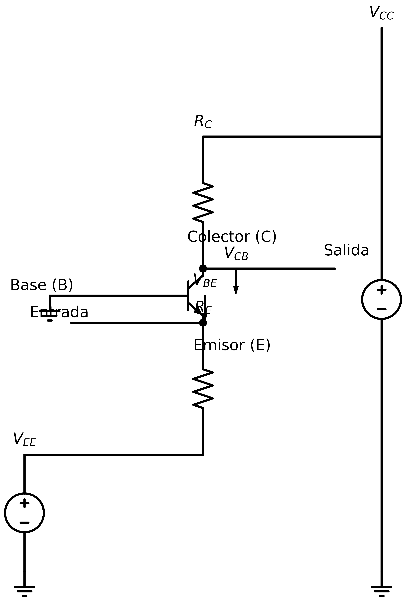
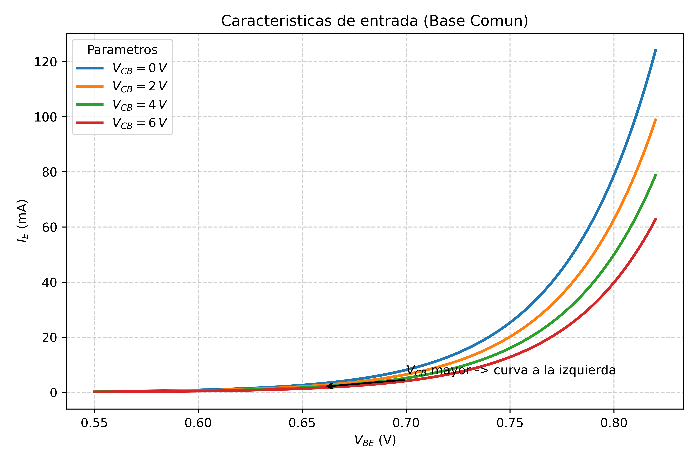

# Transistor BJT: Configuración en Base Común

Se dice que un transistor se encuentra conectado en configuración de **base común** (B-com) debido a que las fuentes de alimentación (típicamente $V_{EE}$ y $V_{CC}$) comparten a la **base** como terminal común. A su vez, esta terminal suele estar conectada directamente a tierra, sirviendo como punto de referencia para todo el circuito.

En esta configuración, la señal de entrada se aplica a través del emisor y la señal de salida se toma desde el colector.



## Características de Entrada

Las **características de entrada** en la configuración de base común describen el comportamiento de la unión Base-Emisor (B-E), la cual se encuentra polarizada en directa. Dado que la unión B-E es fundamentalmente una unión PN, su relación de corriente-voltaje ($I_E$ en función de $V_{BE}$) se asemeja estrechamente a la curva característica de un diodo convencional en conducción.

En la gráfica de características de entrada, se traza la corriente de emisor ($I_E$) frente al voltaje base-emisor ($V_{BE}$) para distintos valores constantes del voltaje colector-base ($V_{CB}$). Se observa que, conforme la magnitud de $V_{CB}$ crece, la curva de corriente se desplaza ligeramente hacia la izquierda (menor $V_{BE}$ requerido para la misma corriente).

Físicamente, esto ocurre porque un mayor $V_{CB}$ (polarización inversa más fuerte en la unión C-B) intensifica el campo eléctrico y ensancha la zona de deplexión hacia el interior de la base (fenómeno conocido como **efecto Early**). Al reducirse el ancho efectivo de la base neutral, el gradiente de concentración de portadores aumenta, facilitando el flujo de electrones (en un transistor NPN) desde el emisor hacia el colector. Como resultado, la corriente de emisor aumenta sutilmente para un nivel dado de $V_{BE}$.

<!-- TODO: Generar gráfica de I_E vs V_BE para distintos V_CB -->


## Características de Salida

Las **características de salida** relacionan la corriente de salida, que es la **corriente de colector ($I_C$)**, con el voltaje de salida, que es el **voltaje colector-base ($V_{CB}$)**.

En la gráfica de características de salida, se representa una familia de curvas que muestran cómo varía $I_C$ en función de $V_{CB}$ para diferentes valores constantes de la corriente de entrada, que en esta configuración es la **corriente de emisor ($I_E$)**.

<!-- TODO: Generar gráfica de I_C vs V_{CB} para distintos I_E -->


A partir de esta familia de curvas, se pueden identificar las tres regiones de operación del transistor y extraer las siguientes conclusiones:

1.  **Región Activa:**
    *   Corresponde a la zona donde la unión colector-base está polarizada en inversa ($V_{CB} > 0$ para un NPN).
    *   Para un valor fijo de $I_E$, la corriente de colector $I_C$ permanece **prácticamente constante** a medida que $V_{CB}$ aumenta. En esta región se observa que $I_C \approx I_E$.
    *   La relación se define por la ganancia de corriente en base común, **alfa ($\alpha$)**:
        $$ \alpha = \frac{I_C}{I_E} $$
    *   Dado que $I_C$ es casi igual a $I_E$, el valor de $\alpha$ es típicamente muy cercano a la unidad (e.g., 0.98 a 0.998), pero **siempre menor que 1**.
    *   Las curvas casi horizontales indican una **impedancia de salida muy alta**.

2.  **Región de Saturación:**
    *   Ocurre cuando **ambas uniones** (Base-Emisor y Colector-Base) están **polarizadas en directa**. Esto corresponde a la zona donde $V_{CB}$ es negativo (para un NPN).
    *   En esta región, la corriente de colector $I_C$ disminuye drásticamente a medida que $V_{CB}$ se vuelve más negativo. Al cruzar hacia valores positivos de $V_{CB}$, $I_C$ crece rápidamente hasta alcanzar el valor de la región activa ($I_C \approx \alpha I_E$).
    *   El transistor pierde su capacidad de amplificación y se comporta más como un interruptor cerrado con una pequeña caída de voltaje.

3.  **Región de Corte:**
    *   Se define por la curva correspondiente a $I_E = 0$.
    *   En esta zona, la corriente de colector es extremadamente pequeña, reduciéndose a la corriente de fuga inversa del colector-base ($I_{CBO}$). El transistor actúa como un interruptor abierto.

    # Transistor BJT: Configuración en Emisor Común

Un transistor NPN se encuentra en configuración de **emisor común** (E-com) cuando la terminal del emisor es compartida como punto de referencia tanto para el circuito de entrada (base) como para el de salida (colector). Esta es la configuración más utilizada en amplificadores de voltaje.

En esta topología, la fuente de alimentación $V_{BB}$ se utiliza para polarizar directamente la unión **Base-Emisor (B-E)**, permitiendo el flujo de la corriente de control de base ($I_B$). Por otro lado, la fuente $V_{CC}$ se encarga de polarizar inversamente la unión **Colector-Base (C-B)**.

Para garantizar que el transistor opere en la región activa, es crucial que el voltaje de colector sea mayor que el de base ($V_C > V_B$), una condición que se logra típicamente asegurando que $V_{CC}$ sea significativamente mayor que el voltaje en la base.

La señal de entrada se aplica a la base y la señal de salida se toma desde el colector, como se muestra en la siguiente figura.

<!-- TODO: Generar esquema con schemdraw -->


# Transistor BJT: Configuración en Emisor Común

Un transistor NPN se encuentra en configuración de **emisor común** (E-com) cuando la terminal del emisor es compartida como punto de referencia tanto para el circuito de entrada (base) como para el de salida (colector). Esta es la configuración más utilizada en amplificadores de voltaje.

En esta topología, la fuente de alimentación $V_{BB}$ se utiliza para polarizar directamente la unión **Base-Emisor (B-E)**, permitiendo el flujo de la corriente de control de base ($I_B$). Por otro lado, la fuente $V_{CC}$ se encarga de polarizar inversamente la unión **Colector-Base (C-B)**.

Para garantizar que el transistor opere en la región activa, es crucial que el voltaje de colector sea mayor que el de base ($V_C > V_B$), una condición que se logra típicamente asegurando que $V_{CC}$ sea significativamente mayor que el voltaje en la base.

La señal de entrada se aplica a la base y la señal de salida se toma desde el colector, como se muestra en la siguiente figura.

<!-- TODO: Generar esquema con schemdraw -->


> **Esquema representativo (Transistor NPN):**
>
> ```text
>           V_BB               V_CC
>            +                  +
>            |                  |
>           .-.                .-.
>       R_B | |            R_C | |
>           '-'                '-'
>            |                  |
> Entrada ---+---- Base (B)     +---- Colector (C) ---- Salida
>                 /|
>               /  |
>              | < | (NPN)
>               \  |
>                 \|
>                Emisor (E)
>                     |
>                    ---
>                     - GND
> ```

## Características de Entrada y Salida

En la configuración de **emisor común (E-com)**, las variables de entrada y salida se definen de la siguiente manera:

-   **Voltaje de entrada:** $V_{BE}$ (voltaje entre la base y el emisor).
-   **Corriente de entrada:** $I_B$ (corriente que fluye hacia la base).
-   **Voltaje de salida:** $V_{CE}$ (voltaje entre el colector y el emisor).
-   **Corriente de salida:** $I_C$ (corriente que fluye a través del colector).

La corriente de base ($I_B$) actúa como la corriente de control que modula la corriente de colector ($I_C$), y el voltaje $V_{BE}$ es el que establece $I_B$.