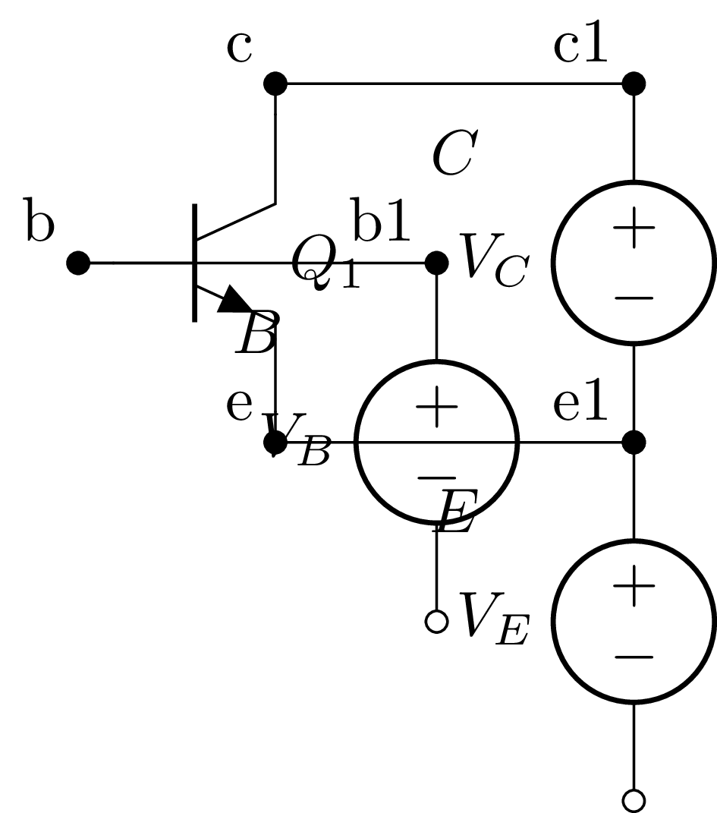
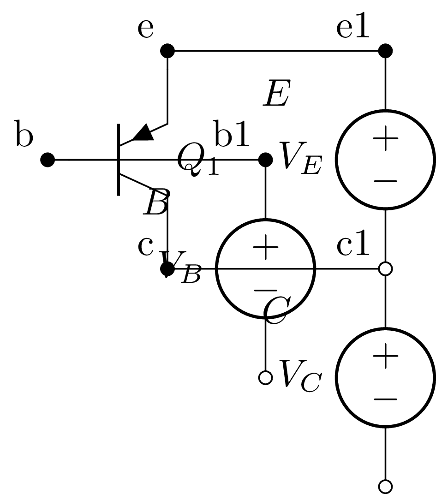
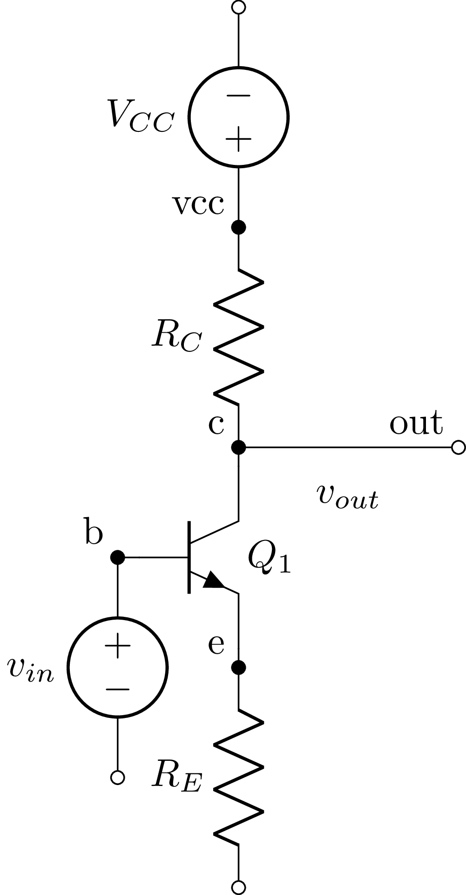
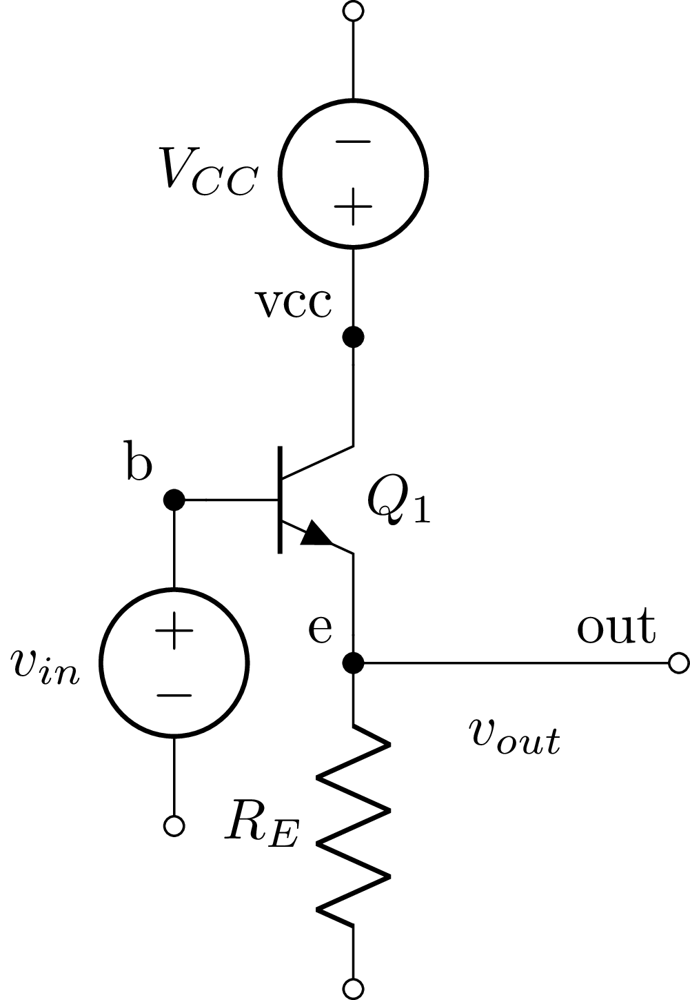
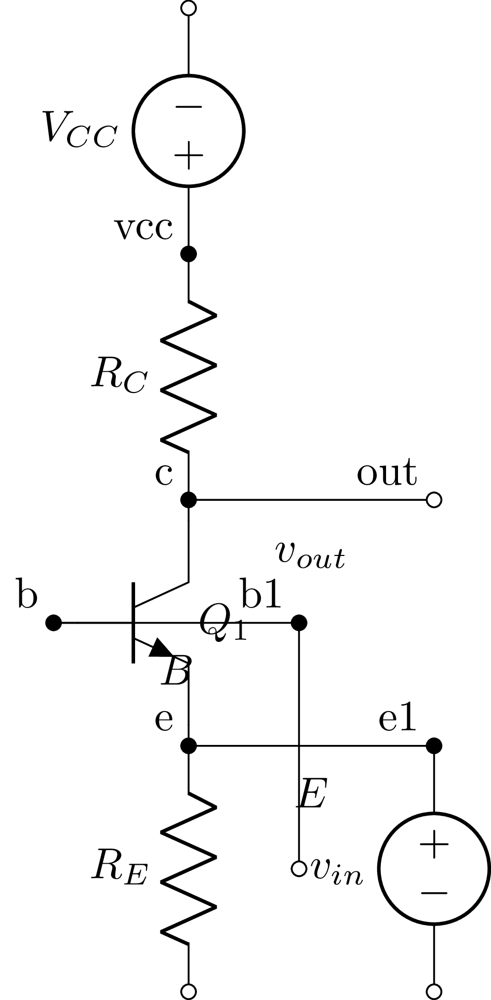

## Pruebas de renderizado con Lcapy

Estas pruebas verifican que Lcapy puede generar simbolos de transistores BJT en formato PNG usando `pdflatex` y `dvisvgm`, con espacio suficiente para rotular el circuito.

### Transistor NPN (espaciado)

### Transistor PNP (espaciado)

## Configuraciones BJT (Lcapy)

### Emisor comun

### Colector comun

### Base comun

## Observaciones sobre solapamiento (Lcapy)

- En los simbolos NPN/PNP espaciados se usan tramos de cable (`W ...; right`) para separar colector, base y emisor antes de bajar a sus fuentes. Esto crea columnas distintas y evita que los elementos queden apilados en el mismo eje.
- En los diagramas correctos (emisor comun y colector comun) cada rama principal tiene su propia referencia de tierra (`0_1`, `0_2`, `0_3`), lo que ayuda al auto‐layout a distribuir verticalmente sin forzar cruces.
- Los diagramas que se solapan tienden a concentrar varias fuentes o cables verticales en el mismo nodo/columna sin un tramo horizontal intermedio, lo que reduce el espacio disponible para labels y hace que Lcapy colapse los elementos.
- La configuracion base comun agrega dos elementos verticales consecutivos en el emisor (`RE` y `Vin` hacia abajo) y un cable de base a tierra (`W b 0_3; down`) sin separar columnas, lo que favorece el amontonamiento.
- Regla practica: agregar un tramo horizontal corto (`W`) antes de bajar a cada fuente o resistor, y usar nodos de tierra distintos (`0_1`, `0_2`, `0_3`) para forzar separacion entre ramas.
